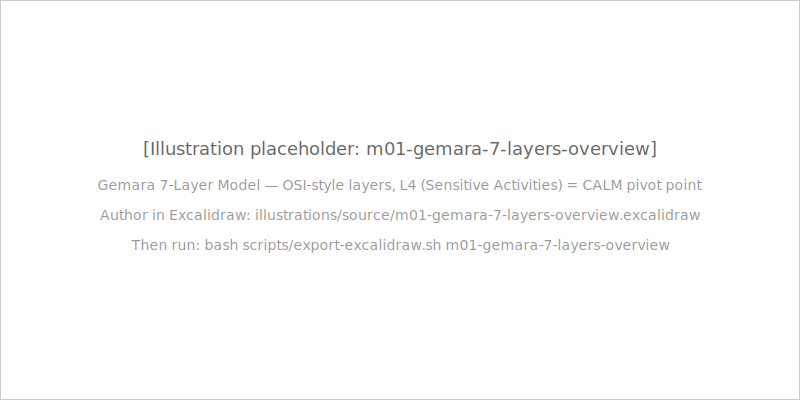
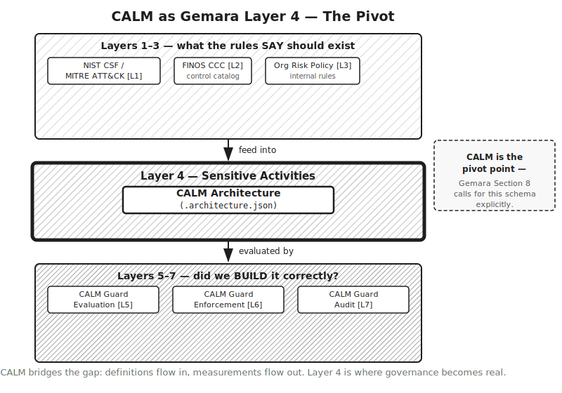

## TL;DR

- Every governance framework — from OpenSSF Gemara to FINOS AIGF to DORA to PCI-DSS — shares a common dependency: machine-readable, current, auditable architecture documentation.
- OpenSSF Gemara is a 7-layer GRC Engineering Model that explicitly calls for this kind of schema. CALM is the answer.
- CALM sits at Gemara Layer 4 — Sensitive Activities — the pivot point between the layers that define what should exist (L1–L3) and the layers that measure whether it does (L5–L7).
- That is the complete Module 1 treatment of Gemara. The full layer-by-layer compliance workflow is Module 4.

## Why it matters

Chapter 1.3 listed what AaC enables: version control, validation, pattern reuse, AI consumption, compliance automation, living documentation. This chapter explains why the governance world is converging on AaC as the answer to a problem they all share. Governance frameworks from six different domains — open source security, AI governance, financial regulation, general IT compliance, cloud security, and supply chain security — are all making the same demand: give us current, complete, machine-readable architecture documentation. CALM is that documentation format.

## The concept

### The shared problem all governance frameworks have

Every modern governance framework, regardless of domain or issuing body, has a documentation problem. The frameworks are well-designed. They articulate requirements clearly. They define controls, specify assessment criteria, and mandate evidence collection. What they do not do is specify the format of the architecture documentation that the controls apply to.

This is the shared gap. A SOX assessor needs to see documentation of IT general controls affecting financial reporting systems — but SOX does not specify what format that documentation must take. A DORA auditor needs documentation of ICT systems and their dependencies — but DORA does not specify whether that documentation should be a Visio diagram, a Confluence page, or a structured JSON file. A PCI-DSS QSA needs to scope the cardholder data environment by understanding which systems touch cardholder data — but PCI-DSS does not specify the technical format of the system documentation used to determine scope.

The result is that every organisation chooses its own documentation format, usually whatever its engineering team finds convenient. The chosen format is typically not machine-readable. It is not version-controlled in a way that produces meaningful diffs. It is not validated against a schema. It is not checkable by automated tools. Every governance framework that requires architecture documentation is receiving it in a format that cannot be automatically processed, validated, or audited.

This format gap has consequences. Governance frameworks that cannot process architecture documentation automatically must rely on human reviewers reading documents. Human reviewers are inconsistent, slow, and non-scalable. A financial institution with hundreds of services, changing weekly, cannot realistically maintain manual governance review of every architectural change. The governance process becomes a periodic review of a snapshot — a quarterly audit, an annual pen test, a biennial regulatory examination — rather than a continuous posture. Between reviews, the architecture can change in ways that violate the governance requirements, with no detection until the next review cycle.

Machine-readable architecture documentation changes this. CALM Guard can check a CALM architecture against declared controls in milliseconds. Every PR that changes the architecture can be evaluated against governance requirements before it merges. Governance shifts from periodic-snapshot to continuous. The governance frameworks all benefit from this shift, even though they were designed before it was possible.

CALM solves the shared format problem. A `.architecture.json` that is machine-readable, version-controlled, schema-validated, and processable by automated tools satisfies the documentation requirement of any governance framework. The frameworks tell you what your architecture must demonstrate; CALM is the artifact that demonstrates it. The shared insight — that every governance framework needs the same machine-readable format — is the reason why multiple frameworks from different issuing bodies and different domains are converging on CALM adoption.

### Gemara — the GRC Engineering Model

OpenSSF Gemara is a 7-layer model for Governance, Risk, and Compliance Engineering. Published by the Open Source Security Foundation (OpenSSF), a Linux Foundation project, in March 2026, Gemara is OSI-inspired — it structures GRC activities as a layered stack where higher layers depend on lower ones, and where there is a clear separation between the layers that define what should exist and the layers that measure whether it does.

Section 8 of the Gemara whitepaper — titled "The Need for Machine-Optimized Documentation" — makes the case for exactly what CALM provides. The whitepaper states: "Achieving an opinionated, standardized schema for each activity type will allow rapid industry-wide acceleration of automated Risk Assessments." CALM is that schema. This is not a marketing claim — it is a structural observation that the Gemara authors make independently of FINOS or CALM, grounded in their analysis of why existing GRC documentation formats (including OSCAL) fall short.

The 7 Gemara layers, briefly:

**L1 — Vectors & Guidance:** Foundational knowledge. Attacker techniques (MITRE ATT&CK), high-level security guidance (NIST CSF, OWASP Top 10), and regulatory frameworks (HIPAA, GDPR, PCI).

**L2 — Threats & Controls:** Technology-specific objectives. Controls with assessment requirements. FINOS CCC (Common Controls Catalog) is explicitly cited at this layer as a canonical asset.

**L3 — Risks & Policy:** Organisation-specific rules based on risk appetite. Policies that reference the threat-informed controls from L2.

**L4 — Sensitive Activities:** The actions that introduce risk — software development, infrastructure provisioning, system design. This is where CALM architectures live.

**L5 — Intent & Behavioral Evaluation:** Inspection of the sensitive activities. Static analysis, configuration scanning, security assessments applied to the L4 activities.

**L6 — Preventive & Remediative Enforcement:** Actions taken based on evaluation results. Deployment gates, corrective actions, preventive controls that block non-compliant activities.

**L7 — Audit & Continuous Monitoring:** Formal audits and continuous compliance monitoring across the other layers.

**CALM is at Layer 4.** The architecture document is the sensitive activity — it is the formal description of the system that introduces risk. Layers 1–3 define what the architecture should satisfy (vectors, controls, policies). Layers 5–7 evaluate, enforce, and audit whether it does. Layer 4 is the artifact being evaluated — and CALM is the machine-optimized format for that artifact.

That is the complete Module 1 treatment of Gemara. The full layer-by-layer compliance workflow — how CALM Guard operates at Layers 5, 6, and 7; how FINOS CCC maps to Layer 2; how organisation-specific risk policies are encoded at Layer 3 — is Module 4. Module 1's job is done with the punchline: CALM is at Layer 4, and Gemara Section 8 explicitly calls for the schema CALM provides.

### The governance landscape

Every framework in the table below is asking for the same artifact — current, machine-readable architecture documentation — in its own vocabulary and for its own regulatory purpose.

| Framework | What it is | Why CALM matters |
|---|---|---|
| **Gemara (OpenSSF)** | 7-layer GRC Engineering Model — explicitly calls for machine-optimized architecture documentation with MCP as the foundation | CALM is the Layer 4 schema Gemara describes but does not implement |
| **FINOS AIGF** | AI Governance Framework — governance overlay for AI systems; auto-attaches as a CALM decorator when `ai:*` nodes are detected | Architecture documentation is a precondition for AI governance; CALM is the format; AIGF is the overlay (taught deeply in Module 5) |
| **Google SAIF** | Secure AI Framework — 6 principles for building and deploying AI systems securely | SAIF principles map to CALM `ai:*` node types and decorators; CALM is how SAIF compliance is documented (Module 5 treatment) |
| **NIST AI RMF** | Risk management framework for AI systems from the National Institute of Standards and Technology | Mappable to CALM controls; CALM provides the architectural context that NIST AI RMF risk assessments require |
| **DORA** | EU Digital Operational Resilience Act — mandates ICT risk management documentation for financial institutions | Architecture documentation is in scope under DORA's ICT risk management requirements; CALM satisfies the documentation requirement with machine-readable, current, version-controlled artifacts |
| **SOX / PCI-DSS** | Sarbanes-Oxley (US financial reporting controls) and Payment Card Industry Data Security Standard | Architecture documentation is required for IT general controls evidence (SOX) and cardholder data environment scoping (PCI-DSS); CALM makes both machine-readable and current |
| **OpenSSF OSPS Baseline** | Open Source Project Security Baseline — supply chain security controls; a canonical Layer 2 asset in Gemara | Maps to CALM controls for supply chain security; CALM provides the architectural context that OSPS Baseline controls apply to (Module 4 treatment) |

Walk through two of these in more depth to see the pattern.

**DORA and CALM.** The Digital Operational Resilience Act requires financial institutions to maintain documentation of their ICT systems, their dependencies, and their digital operational resilience capabilities. Article 8 of DORA covers ICT risk management and mandates that institutions maintain an inventory of ICT assets and map dependencies between them. A `.architecture.json` that declares all nodes (services, databases, network components), their relationships, and their interfaces is exactly the kind of machine-readable dependency map that satisfies this requirement. And because the CALM document is version-controlled and CI-enforced, the "maintain" requirement is met by engineering practice, not by a documentation sprint before the regulatory review cycle.

**AIGF and CALM.** The FINOS AI Governance Framework addresses the specific governance challenges introduced by AI systems — bias, explainability, data lineage, model risk, and accountability. AIGF is designed as a governance overlay: it attaches to an architecture when that architecture includes AI systems, as signalled by the presence of `ai:*` node types in the CALM document. When a CALM architecture declares an `ai:inference-service` node, AIGF governance requirements automatically attach as decorators. The architecture document becomes the trigger for governance, and the governance requirements are encoded in the same file as the architecture. This is only possible because the architecture is a machine-readable file; a Visio diagram cannot have decorators.

### The shared insight

Every framework in the governance landscape above has something in common: they describe requirements but do not provide the documentation format that the requirements need.

SOX tells you that IT general controls must be documented, reviewed, and traceable. It does not tell you the format. DORA tells you that ICT dependencies must be documented. It does not tell you the format. AIGF tells you that AI governance requirements must be attached to AI systems. It does not tell you the format of the system representation those requirements attach to.

CALM is that format. The frameworks tell you what your architecture must demonstrate; CALM is the artifact that demonstrates it. This is why FINOS stewards CALM and why OpenSSF Gemara explicitly calls for the kind of schema CALM provides. The governance world is converging on the requirement; CALM is the answer to the requirement.

## Common mistakes

**Trying to understand all 7 Gemara layers in Module 1.** Module 4 covers Gemara in depth — each layer, how CALM Guard implements Layers 5–7, how FINOS CCC maps to Layer 2, how organisational risk policies are encoded at Layer 3. Module 1's job is to establish that CALM = Layer 4 and to motivate why that matters. Stop at the punchline.

**Treating AIGF, SAIF, and NIST AI RMF as overlapping frameworks.** They address different aspects of AI governance: AIGF is the governance overlay that attaches to CALM architectures; SAIF is the security framework that maps to `ai:*` node types; NIST AI RMF is the risk management framework that CALM controls can satisfy. They are complementary, not redundant. Module 5 covers their interaction in depth.

**Citing specific regulatory article numbers in Module 1 discussions.** This chapter uses DORA as an example and references ICT risk management requirements at a conceptual level. The specific article and sub-article citations — DORA Article 8, Article 11, Annex I — are the domain of Module 6 (Enterprise Adoption), where learners engage with the full regulatory compliance workflows. Module 1 establishes the motivation; Module 6 provides the operational guidance.

**Treating "frameworks need CALM" as "frameworks use CALM today."** The adoption trajectory is the correct framing. Governance frameworks are converging on the requirement that CALM addresses. FINOS member organisations are adopting CALM. The FINOS CALM Working Group is the canonical source for current adoption status. Do not invent specific adoption claims.

## Knowledge check

[Take the Module 1 quiz](../../quizzes/module-01-case-for-aac.yaml)

## Further reading

- [Introducing CALM](./introducing-calm.mdx) — Chapter 1.5: the FINOS ecosystem and specification that enables the compliance capabilities this chapter describes
- [What Architecture as Code Enables](./what-architecture-as-code-enables.mdx) — Chapter 1.3: the six capabilities that make CALM the answer to the governance frameworks' shared problem
- [Gemara Analysis](../../.planning/research/gemara-analysis.md) — internal research document with full Gemara layer-by-layer analysis and source references
- [OpenSSF Gemara project](https://openssf.org/projects/gemara/) — the primary source for Gemara model and whitepaper
- [FINOS AIGF](https://www.finos.org/ai-governance-framework) — the AI Governance Framework referenced in this chapter
