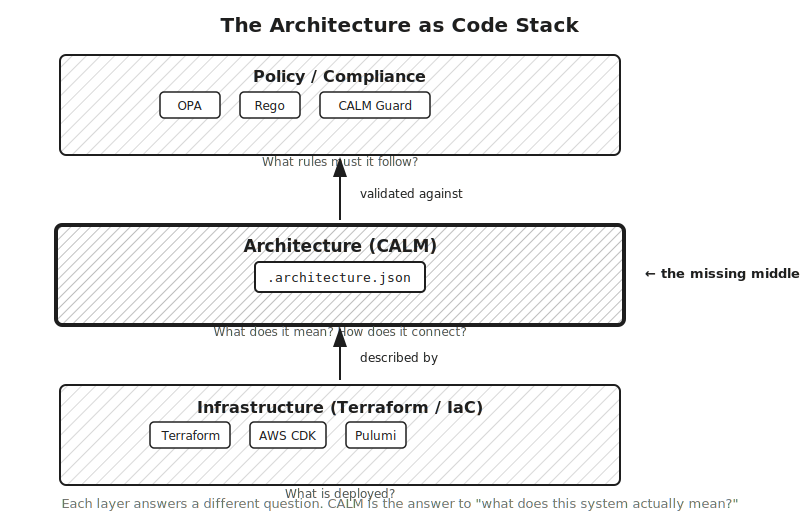
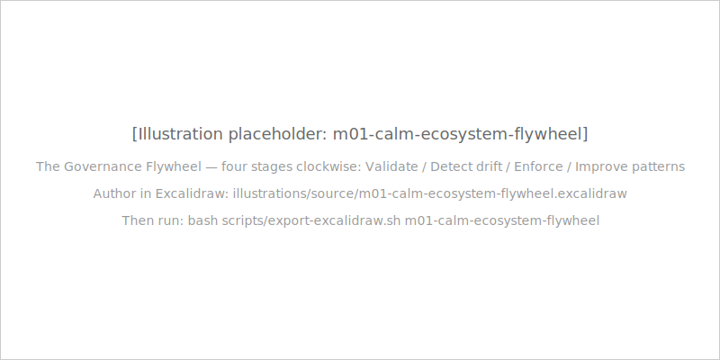

## TL;DR

- Architecture as Code unlocks six capabilities that are impossible with diagrams: version control, automated validation, pattern reuse, AI consumption, compliance automation, and living documentation.
- Each capability requires architecture to be a real file, not a diagram — a machine-readable artifact that tools can read, validate, and generate from.
- None of these capabilities were available when architecture lived in Visio or Confluence; all of them are available when architecture is a `.architecture.json`.
- These capabilities do not all land at once — they unlock progressively as the organisation matures its architecture practice.

## Why it matters

Chapter 1.2 made the case that architecture should be code by analogy — the same pattern that worked for infrastructure and configuration works for architecture. This chapter makes the case by enumeration. The question is not just "should architecture be a file?" but "what becomes possible when it is?"

The answer is six capabilities that were not available before.

## The concept

### Version control

When architecture is a `.architecture.json` file committed to source control, the entire Git history of every architectural decision becomes available.

`git diff` between two architecture versions shows exactly what changed: which nodes were added, which relationships were removed, which interfaces were modified. The diff is structured and machine-readable — not a visual comparison of two diagram snapshots, but a line-by-line comparison of the JSON that describes the architecture. Architecture changes become pull requests. PRs have reviewers. Reviewers can challenge architectural decisions before they ship. "Why are we adding a direct database connection here when the pattern calls for service-to-service?" becomes a comment on a PR, resolved before the code is written — not a discovery six months later during an incident.

History becomes an audit trail with genuine resolution. When a compliance auditor asks "when did you add the payment service and what architectural decisions were made at that time?" — the Git log answers the question precisely. Not "we think it was around Q3 based on the Confluence page creation date" but "it was added in commit `a3f8b2c`, reviewed by these two engineers, merged on this date after addressing two comments about the database connection topology." For regulated industries operating under SOX, DORA, or PCI-DSS, this level of traceability for architectural decisions is transformative. It changes architecture governance from a documentation exercise to a verifiable record.

Architecture changes that bypass code review are visible as commits without PR approval. The human enforcement gap that diagrams have — "did someone actually update the diagram?" — does not exist for version-controlled files. The file is either in the right state or it is not. If the file was not updated when a service was added, the file is wrong in a detectable and remediable way. If a diagram was not updated when a service was added, the diagram is wrong in a way that may not be discovered for months or years.

### Automated validation

CI/CD pipelines can validate architecture before any deployment proceeds. The architecture must pass `calm validate` before code can be merged.

This changes the failure mode for architectural violations from "we'll discover this in production" to "we discover this in the PR." Schema violations — using an invalid node type, omitting a required field, specifying a non-existent relationship type — are caught before they reach the main branch. Pattern violations — an architecture that does not conform to the organisation's approved "secure API service" pattern — are caught in the pipeline.

The class of architectural incidents that the 3am scenario in Chapter 1.1 represents — an undocumented dependency that caused a production failure — does not disappear, but it shrinks. Dependencies that are not declared in the architecture document are detectable gaps. A CI gate that requires every external dependency to be declared makes undeclared dependencies a build failure, not a production surprise.

The validation also applies to pattern conformance. When an organisation's platform team publishes a pattern that says "all services must declare their interfaces formally," any architecture that does not declare its interfaces fails `calm validate`. The policy enforcement that previously required a manual architecture review in a change-approval board meeting can be automated in CI.

### Pattern reuse

Organisations can encode approved architectural blueprints as reusable CALM patterns. The platform team publishes a "secure API service" pattern — a blueprint that captures the organisation's approved topology for an API service: required nodes, required relationships, required controls, required interface declarations. Product teams instantiate from this pattern rather than designing from scratch.

Every new service starts architecturally compliant. The product team does not need to rediscover that the organisation requires services to declare their health-check interfaces, or that production services must include a database node for their configuration store — the pattern encodes these requirements. Deviation from the pattern is a validation failure.

This is the same value proposition as Terraform modules: instead of every engineer independently figuring out how to provision a VPC with the correct security groups, the platform team publishes a module and product teams use it. The pattern is the module, but for architecture rather than infrastructure.

Patterns also evolve. As real-world architectures are published to CALM Hub, pattern authors can observe which implementations diverge from the pattern and why. Divergences that represent legitimate evolution of the pattern are incorporated back into the pattern definition. The flywheel turns: validate → detect drift → enforce → improve patterns → validate more architectures against better patterns.

### AI consumption

Language models can reason over structured JSON specifications in ways they cannot reason over prose documents or diagram images. When a CALM document is the system context for an AI-assisted development session, the AI's responses are grounded in the actual architecture rather than general knowledge.

"Build me a payment service" with no context produces generic code. "Build me a payment service that conforms to this `.architecture.json`" — where the JSON specifies that the payment service must connect to the settlement database via a formally declared interface, must include a health-check endpoint, and must be a `service` node type — produces code that respects the architectural constraints. The AI is working from the specification rather than from inference.

This capability grows in importance as AI-assisted development becomes mainstream. An LLM that can read the architecture of the whole system, understand the relationships between components, and generate code that correctly positions a new service within that architecture is a qualitatively different development tool than one working from a diagram image or a prose description. The `.architecture.json` is the grounding document that makes architectural AI assistance precise rather than plausible.

The full treatment of AI consumption — spec-driven development, the multi-agent reference architecture, `ai:*` node types — is in Module 5. This chapter establishes the foundational capability.

### Compliance automation

When controls are encoded into the architecture document itself, compliance evidence is generated automatically rather than reconstructed before each audit.

A CALM `control` element attached to a service node says "this service must implement TLS 1.3 for all external communications." CALM Guard — the compliance automation tool in the FINOS ecosystem — reads the architecture document, checks whether the declared control is implemented, and produces a structured evidence artifact. The auditor receives the evidence artifact rather than a slide deck assembled under pressure.

This changes the compliance cycle from "prepare documentation for the upcoming audit" to "the documentation is maintained continuously and the evidence is always current." Teams at financial institutions running under SOX, DORA, and PCI-DSS can shift from quarterly documentation sprints to continuous compliance posture.

Chapter 1.4 previews the governance frameworks that need this capability. Module 4 covers the full compliance automation treatment.

### Living documentation

Generated documentation stays in sync with the architecture because it is derived from the same source-of-truth file that the engineers maintain.

`calm docify` generates human-readable documentation from a CALM architecture document: service inventory, dependency maps, interface documentation, control summaries. When the architecture changes and a developer adds a node or modifies a relationship, the documentation regenerates from the updated file. The documentation question shifts from "is this current?" to "when was this last regenerated?" — and the answer to the second question is "whenever the file last changed." The currency of the documentation is bounded by the currency of the architecture file, which is enforced by CI. If the CI gate requires the architecture to be valid before merging, the documentation is never more than one regeneration behind.

This matters most for the people who depend on documentation the most: new engineers joining a project. The discovery time that [The Architecture Debt Crisis](./architecture-debt-crisis.mdx) described — weeks spent finding things the diagram does not mention, discovering undocumented dependencies, tracing data flows that no diagram captures — does not disappear entirely, but it shrinks dramatically when the architecture documentation reflects the current state of the system rather than its state at a point two years ago.

Contrast this with the alternative: a Confluence page that someone must remember to update, a Visio diagram that diverges from reality over time, a README that was accurate at project launch and has not been touched since. In every case, the documentation is a separate artifact from the system it describes. Its currency depends on human discipline and human memory. In the CALM model, the documentation is derived from the authoritative description of the system — it cannot become inaccurate without the source becoming inaccurate first.

For teams operating in regulated environments, living documentation also means that the documentation presented to auditors is the same documentation that engineers use to work with the system. There is no "audit documentation" that is maintained separately from "working documentation" — there is one documentation artifact, kept current by the same engineering practices that keep the code current. The audit evidence and the working reality are the same document. That convergence is what transforms compliance documentation from an onerous process into an automatic byproduct of good engineering.

## Common mistakes

**Expecting all six capabilities to land in week one.** Version control is available immediately when the `.architecture.json` is committed. Automated validation requires a CI integration. Pattern reuse requires patterns to exist. Compliance automation requires CALM Guard to be configured. Living documentation requires a documentation pipeline. These capabilities unlock progressively as the organisation invests in its architecture practice, not all at once.

**Treating pattern reuse as a copy-paste exercise.** Patterns are validated against, not copied from. A product team that copies a pattern and modifies it without publishing the modification back to CALM Hub has created a local variation that is invisible to governance tooling. The value of patterns is that they are applied through a mechanism that checks conformance, not through a manual copy process.

**Believing AI consumption requires future technology.** LLMs use CALM as grounding today. The `.architecture.json` is a structured JSON file that current-generation language models can read, understand, and reason over. The capability is available now, not in a future with AGI. What Module 5 adds is the structured framework for doing this systematically — but the foundational capability is present in today's tools.

**Confusing compliance automation with compliance certification.** Automation produces evidence; certification still requires human review. CALM Guard can verify that a declared control is implemented and generate an evidence artifact. Whether that evidence satisfies a regulator's requirement for a specific control under a specific regulatory regime is a human judgement that CALM Guard supports but does not replace. The value is in the evidence quality and availability, not in eliminating human oversight.

## Knowledge check

[Take the Module 1 quiz](../../quizzes/module-01-case-for-aac.yaml)

## Further reading

- [Governance Frameworks and Why They Need AaC](./governance-frameworks-and-aac.mdx) — Chapter 1.4: the governance frameworks that require the compliance automation capability
- [Lessons from Adjacent Disciplines](./lessons-from-adjacent-disciplines.mdx) — Chapter 1.2: why the `.architecture.json` is the right artifact to enable all six capabilities
- [Your First CALM Document](../module-00-on-ramp/your-first-calm-document.mdx) — the artifact you produced in Module 0 that all six capabilities build on
