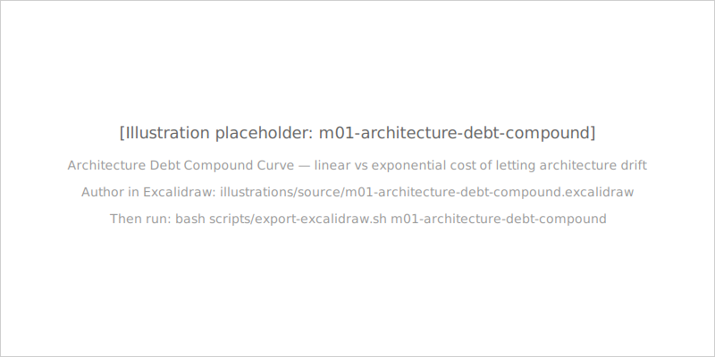
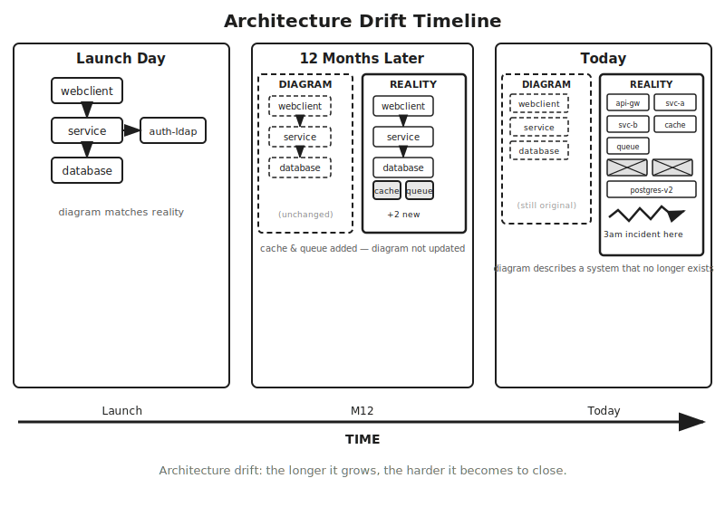
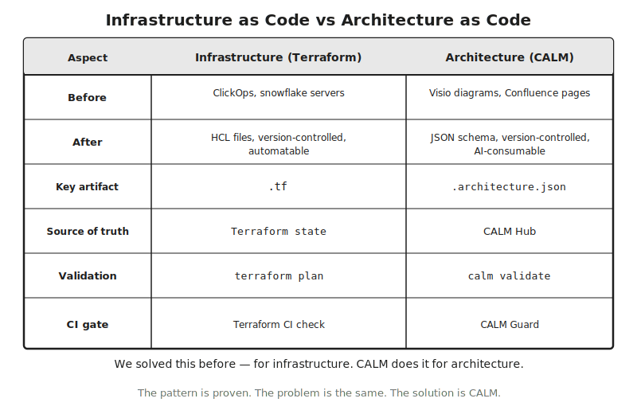

# Module 1: The Case for Architecture as Code

## *"Terraform transformed infrastructure. CALM transforms architecture."*

<!--
Speaker note: Open with the tagline. Set the room expectation: this module is the persuasion phase — by the end you will know why a .architecture.json is fundamentally different from a slide deck. Before we can teach the vocabulary or the tooling, we need to earn the question: "why does this matter?" That is what this module does.
-->

---

## Architecture lives in PowerPoint

- Diagrams lie
- Nobody updates them
- AI cannot read them
- CI/CD cannot validate them

<!--
Speaker note: Ask the audience: when did your architecture diagram last perfectly match production? Most people cannot remember. That is the problem this module exists to solve. Every team has a gap between the diagram and the running system. The gap widens every day. The question is not whether your diagrams are wrong — it is how wrong they are, and what will happen when that wrongness becomes visible under pressure.
-->

---

## Case study: the 3am incident

- A payments platform is down — 3am Eastern
- Planned migration decommissioned a legacy authentication service
- The dependency was undocumented — absent from every diagram
- A senior engineer's 22-month-old memory resolved the incident after 90 minutes

<!--
Speaker note: Walk through the FSI incident as the cold-open. The point is not to teach about payments architecture — it is to make the cost of drift concrete and visceral. The dependency was real. It had been there for three years, handling token validation for a batch settlement workflow. It was absent from every architecture diagram the team had. Nobody was negligent; the diagram simply was not updated when the dependency was quietly wired in during a crunch period two years earlier. The incident was the ordinary consequence of three years of architecture drift made visible at the worst possible time.
-->

---

## Architecture debt compounds

- **Onboarding:** new engineers spend weeks discovering what the diagram omits
- **Incidents:** teams navigate by memory during 3am failures, not by documentation
- **Compliance audits:** reconstruction sprints before every regulatory review cycle

<!--
Speaker note: The chart is illustrative — do not quote specific numbers. The point is the SHAPE of the curve. Drift cost grows faster than the cost to prevent it. Each of these three costs is paid every quarter. They do not amortise — they accrue. The compound curve is directional: weeks of onboarding friction, hours per incident response, months of audit prep.
-->

---

## Architecture drift: how it happens

- **Launch day:** diagram and reality match
- **12 months later:** new services added, diagram not updated
- **Today:** the diagram describes a system that no longer exists

<!--
Speaker note: Walk the audience through the three panels. Launch day everything matches. 12 months later a cache and queue were added without diagram updates. Today three new services have been added, two deprecated ones are still shown, and the diagram describes a system that no longer exists. The 3am incident lives in that gap. Ask: "Who in this room has an architecture diagram that they know is wrong?" Most hands go up. That is the normal state of architecture documentation today.
-->

---

## The regulated industry lens

- **DORA Article 8** — ICT risk management documentation: financial institutions must maintain current, complete documentation of ICT systems and dependencies
- **SOX** — IT general controls evidence: architecture documentation is required for change management traceability
- **PCI-DSS** — cardholder data environment scoping: incorrect architecture documentation leads to incorrect scope determinations

Every regulator asks for current, complete, auditable architecture documentation. Most teams produce a slide deck.

<!--
Speaker note: Set up the question the rest of the module answers: what if the architecture document could not drift from reality? Save the framework deep-dives for Module 4 — this is the establishing shot. The shared pattern: regulators ask for current documentation. Teams produce the best they can, which is typically a diagram that everybody in the room knows is months out of date. The audit becomes a ritual rather than a verification. CALM changes this.
-->

---

# "We've solved this before. Twice."

- **Configuration as Code** — Ansible, Chef. We solved configuration drift.
- **Infrastructure as Code** — Terraform. We solved ClickOps.

Architecture is the next application of the same pattern.

<!--
Speaker note: Set up the structural-pattern argument. This is the chapter where the IaC analogy lands. The story of software engineering over the past twenty years is the story of making manual management unnecessary by replacing human judgement with machine enforcement. Resist the urge to deep-dive Terraform history — keep it as a comparison. The pattern is what matters, not the history.
-->

---

## Configuration as Code: the first lesson

- Before Ansible/Chef: sysadmins hand-configured servers; configuration drift was the norm
- Configuration files in version control, applied by automated tools
- Configuration became a first-class engineering artifact — with Git history, code review, and CI validation
- Result: "Why does staging differ from production?" became answerable by diffing files, not archaeological excavation

<!--
Speaker note: Two paragraphs of context max. The point of this slide is to anchor the pattern, not teach Ansible. Every time manual management was replaced by a version-controlled artifact with CI enforcement, the drift problem was eliminated. Configuration drift was solved first. Infrastructure drift was solved second. Architecture drift is next.
-->

---

## Infrastructure as Code: the second lesson

- Before Terraform: ClickOps, snowflake servers, no reproducibility — nobody knew what was actually deployed
- The `.tf` file became the source of truth: declared, version-controlled, reviewable, automatable
- `terraform plan` made the gap between intent and reality explicit and enforceable
- IaC is now the default — AWS CDK, Pulumi, OpenTofu all followed because the pattern was correct

<!--
Speaker note: Terraform is the canonical example because the analogy is structurally exact. Each component that made Terraform work has a CALM equivalent — the next two slides make that explicit. Teams that adopted Terraform in 2015 did not spend 2019–2022 reconciling three environments that had drifted apart. The early-adoption advantage in IaC was real and substantial. The same dynamic is playing out now in architecture.
-->

---

## The AaC stack

- **Bottom — Infrastructure (Terraform):** what is deployed
- **Middle — Architecture (CALM):** what it means and how it connects
- **Top — Policy (OPA, CALM Guard):** what rules apply

<!--
Speaker note: CALM is the missing middle layer. Terraform tells you what is deployed. OPA tells you what is allowed. CALM tells you what it MEANS. Between infrastructure and policy there was a gap — the architecture layer. What is this system? What components does it have? How do they connect? What controls must they satisfy? Until CALM, this layer had no machine-readable format. Infrastructure had Terraform. Policy had OPA. Architecture had Visio.
-->

---

## IaC vs AaC: the structural comparison

| | Terraform | CALM |
|---|---|---|
| Key artifact | `.tf` | `.architecture.json` |
| Validation | `terraform plan` | `calm validate` |
| CI gate | Terraform CI check | CALM Guard |

<!--
Speaker note: Walk a couple of rows. The point: row-by-row equivalence, not slogan. Each thing that made Terraform work has a CALM equivalent — by design, not by accident. Before: Terraform replaced ClickOps with HCL files; CALM replaces Visio diagrams with JSON schema. Source of truth: Terraform state vs CALM Hub. Validation: terraform plan vs calm validate. The "nobody knows what's actually deployed" problem was solved by Terraform. The "nobody knows what the architecture actually is" problem is solved by the same structural approach.
-->

---

# What AaC enables: overview

- If architecture is a file, you can do things with it that you cannot do with a diagram
- Six capabilities — each requires the file

<!--
Speaker note: Frame this chapter as the payoff. Chapter 1.1 was the problem; 1.2 was the historical pattern; 1.3 is what you can now DO. The question is not just "should architecture be a file?" but "what becomes possible when it is?" The answer is six capabilities that were not available before. None of these capabilities were available when architecture lived in Visio or Confluence; all of them are available when architecture is a .architecture.json.
-->

---

## Version control + Automated validation

**Version control:**
- `git diff` between architecture versions — see exactly what changed
- PRs become architectural reviews; history becomes an audit trail with genuine resolution
- Architecture changes that bypass review are visible as commits without PR approval

**Automated validation:**
- CI/CD gate before any deployment: architecture must pass `calm validate` before code merges
- Schema violations and pattern violations caught in the PR, not in production

<!--
Speaker note: These two capabilities unlock the engineering hygiene case for AaC. Most teams understand the value the moment you show them a git diff of two architecture versions. Version control answers the compliance question: "when did you add the payment service and what architectural decisions were made?" The Git log answers precisely — not "we think it was Q3" but a commit with reviewers, date, and rationale. For regulated industries under SOX, DORA, or PCI-DSS, this level of architectural decision traceability is transformative.
-->

---

## Pattern reuse + AI consumption

**Pattern reuse:**
- Approved blueprints as organisational standards
- Platform team publishes a "secure API service" pattern; product teams instantiate from it
- Every new service starts architecturally compliant; deviation is a validation failure

**AI consumption:**
- LLMs reason over structured JSON specifications — not diagram images or prose descriptions
- CALM as system context grounds AI-generated code in actual architecture constraints
- "Build me a payment service conforming to this `.architecture.json`" produces architecturally correct code

<!--
Speaker note: Pattern reuse is the Terraform-modules-for-architecture move. Instead of every engineer independently figuring out the organisation's approved service topology, the platform team publishes a pattern. AI consumption is the new capability — Module 5 covers the multi-agent ARB case study and spec-driven development in depth. The foundational insight: LLMs that can read architecture JSON are qualitatively different tools than ones working from diagram images.
-->

---

## Compliance automation + Living documentation

**Compliance automation:**
- Controls encoded into the architecture document itself
- CALM Guard evaluates controls and produces structured evidence artifacts automatically
- Auditors receive a structured artifact — not a slide deck assembled under pressure

**Living documentation:**
- `calm docify` generates docs from the CALM JSON — documentation regenerates when architecture changes
- The currency question shifts from "is this current?" to "when was this last regenerated?"
- By construction, documentation cannot become more stale than the architecture file itself

<!--
Speaker note: Compliance automation is the bridge to Chapter 1.4. Living documentation is the bridge to Module 3. End the chapter on the optimism — this is the payoff slide. For regulated environments, living documentation means that the documentation presented to auditors is the same documentation engineers use to work with the system. There is no separate "audit documentation" — there is one artifact, kept current by the same engineering practices that keep the code current.
-->

---

## The value case in one sentence

> "Architecture as a file unlocks six capabilities you cannot get from a diagram — version control, automated validation, pattern reuse, AI consumption, compliance automation, and living documentation."

<!--
Speaker note: Pause here. Let the room write down the one sentence they will use to sell this to their team. These capabilities unlock progressively as the organisation matures its architecture practice — not all at once. Version control is available immediately when the .architecture.json is committed. Compliance automation requires CALM Guard to be configured. But the foundation — the file — enables all six from day one.
-->

---

# Every governance framework needs the same thing

- Current, complete, machine-readable architecture documentation
- Different vocabularies. Different regulators. Same artifact requirement.

The frameworks tell you what your architecture must demonstrate. CALM is the artifact that demonstrates it.

<!--
Speaker note: Frame the chapter: this is not "pick your framework." Every governance framework converges on the same artifact need, regardless of domain or issuing body. SOX does not specify the documentation format. DORA does not specify whether documentation should be a Visio diagram or a JSON file. PCI-DSS does not specify the technical format of system documentation. Every organisation chooses its own format — typically not machine-readable, not version-controlled, not schema-validated. CALM solves the shared format problem.
-->

---

## Gemara: the GRC Engineering Model

OpenSSF 7-layer GRC Engineering Model, OSI-inspired. Section 8 explicitly calls for machine-optimised documentation standards.

<!--
Speaker note: Cite the Gemara Section 8 quote attributably: "Achieving an opinionated, standardized schema for each activity type will allow rapid industry-wide acceleration of automated Risk Assessments." CALM is that schema. This is not a marketing claim — it is a structural observation the Gemara authors make independently of FINOS, grounded in their analysis of why existing GRC documentation formats fall short. Do not deep-dive layers 5–7 — that is Module 4.
-->

---

## CALM at Gemara Layer 4

- **Layers 1–3** define what should exist: vectors, controls, policies
- **Layer 4 — Sensitive Activities:** CALM architecture is the machine-optimised representation
- **Layers 5–7** evaluate, enforce, and audit whether it does

<!--
Speaker note: This is the Module 1 punchline for Gemara. STOP here. Full layer-by-layer treatment is Module 4. The takeaway: CALM is the pivot point. The architecture document is the sensitive activity — it is the formal description of the system that introduces risk. Layers 1–3 define what the architecture should satisfy. Layers 5–7 evaluate whether it does. Layer 4 is the artifact being evaluated, and CALM is the machine-optimized format for that artifact.
-->

---

## Governance frameworks at a glance

| Framework | What it is | Why CALM matters |
|---|---|---|
| **AIGF** | FINOS AI Governance Framework | Auto-attaches as decorator on `ai:*` nodes |
| **SAIF** | Google Secure AI Framework — 6 principles | Maps to `ai:*` node types and decorators (Module 5) |
| **DORA** | EU operational resilience act | CALM satisfies ICT risk management documentation |
| **SOX/PCI-DSS** | Financial compliance standards | Machine-readable architecture meets audit requirements |

<!--
Speaker note: Walk fast. The point is the shared shape of the problem, not a deep-dive into any framework. Module 4 and Module 6 cover the specifics. For AIGF: when a CALM architecture declares an ai:inference-service node, AIGF governance requirements automatically attach as decorators — only possible because the architecture is a machine-readable file. For DORA: the "maintain" requirement is met by engineering practice, not by a documentation sprint before the regulatory review cycle.
-->

---

## The shared problem all frameworks share

> "Every framework describes requirements but provides no documentation format. CALM is that format."

The governance world is converging on the requirement. CALM is the answer to the requirement.

<!--
Speaker note: This is the chapter takeaway. Pause for emphasis. SOX does not specify format. DORA does not specify format. PCI-DSS does not specify format. Every organisation chooses its own format, usually whatever the engineering team finds convenient — typically not machine-readable, not version-controlled, not schema-validated. CALM is why FINOS stewards a public open standard and why OpenSSF Gemara explicitly calls for the kind of schema CALM provides.
-->

---

# Introducing FINOS CALM

- FINOS is the open standard home for Architecture as Code
- CALM 1.2: nodes (9 core + 15 `ai:*` types), relationships, interfaces, controls, decorators

An open standard under FINOS governance — evolving through the FINOS CALM Working Group.

<!--
Speaker note: Introduce FINOS as the steward briefly. The choice of open standard matters: if CALM were a proprietary format owned by a vendor, adopting it would mean accepting vendor lock-in for a core engineering artifact. FINOS governance means CALM is governed by the organisations that use it. The spec cannot be changed unilaterally by a single firm. Do not deep-dive the spec — that is Module 2. This chapter is "meet the spec," not "read the spec."
-->

---

## The CALM ecosystem

- **CLI** — validate, diff, docify
- **Hub** — versioned registry ("npm registry for architectures")
- **Studio** — visual canvas with bidirectional sync
- **Guard** — AI-driven compliance automation
- **calmstudio-mcp** — AI-driven architecture creation (used in Module 0)

<!--
Speaker note: This is the flagship ecosystem visual. Walk the spokes. Stay at the "what each tool does" level — Module 3 teaches each tool in depth. The key message: CALM is surrounded by a growing ecosystem that covers the complete AaC workflow from creation (calmstudio-mcp) through validation (CLI) to compliance (Guard) to governance (AIGF decorator). You used calmstudio-mcp in Module 0; this is the bigger picture of where that tool sits.
-->

---

## Community, governance, and adoption

- **FINOS CALM Working Group** — spec governance, open to all
- **Open standard** — no vendor lock-in; governed by organisations that use it
- **Adoption** — teams at FINOS member organisations; FINOS CALM Working Group is the canonical status source
- **One concrete reference:** the FINOS Multi-Agent Reference Architecture (ARB) is available as a CALM pattern in the FINOS repository

<!--
Speaker note: Do NOT invent adoption numbers. Frame adoption as "in progress, FINOS Working Group is the canonical status source." If asked for a specific adopter, cite the FINOS Multi-Agent Reference Architecture — that is a real artifact, a CALM document encoding a reference architecture for multi-agent AI systems in financial services. Contributing to CALM — filing issues, proposing new node types — is open to anyone. The FINOS CALM Working Group meets regularly; the meeting schedule is in the repository.
-->

---

## Module 1 summary: the case is made

- Architecture diagrams drift from production reality — the cost compounds as onboarding pain, incident time, and audit reconstruction sprints
- The industry solved this before for configuration and infrastructure; CALM is the same pattern applied to the missing middle layer
- Architecture as a file unlocks six capabilities: version control, validation, pattern reuse, AI consumption, compliance automation, living documentation
- Every governance framework converges on the same artifact need; CALM is that artifact; CALM sits at Gemara Layer 4
- FINOS stewards CALM 1.2; the ecosystem is CLI, Hub, Studio, Guard, and MCP

**Before Module 2:** Sketch the architecture of a system you work on from memory. Save the sketch — it becomes your Module 2 starting point.

<!--
Speaker note: Set up the reflection exercise as the homework between Module 1 and Module 2. Do not skip this — Module 2 builds on the sketch. The case is made. Now the learner needs the vocabulary. The sketch from memory is a diagnostic — a baseline measurement of how much architecture knowledge you carry in your head versus how much is in documentation. Most engineers are surprised by how much they omit when drawing from memory. The omissions are the architecture drift in your own head.
-->

---

# What's next: Module 2 — CALM Fundamentals

Now you learn the language.

9 core node types. 5 relationship types. Interfaces, controls, decorators.

The vocabulary you need to read and write CALM precisely.

<!--
Speaker note: Close the deck. Hand the audience over to Module 2. The case is made — they know WHY architecture as code matters. Module 2 gives them the vocabulary to DO it. The spec is waiting. The tools are ready. The pattern is proven. Now they learn the language.
-->
