# Module 2: CALM Fundamentals

## *"From vocabulary to your first validated architecture."*

<!-- Speaker note: This module teaches the CALM language. By slide 38 the audience will know the 9 node types, 5 relationship types, 12 protocols, both interface forms, how controls attach, and what decorators do — and they will have watched a complete architecture built step by step from a blank document. Welcome to the vocabulary module: this is the reference-grade spec knowledge every CALM practitioner needs cold. -->

---

## What you will learn in this module

- **2.1** The CALM specification — anatomy, `$schema` URL, what the validator checks
- **2.2** Nodes — all 9 core types with FSI examples
- **2.3** Relationships — all 5 types; the protocol-placement rule
- **2.4** Interfaces — freeform vs formal, where they live
- **2.5** Controls — testable compliance, 4 attachment scopes
- **2.6** Decorators — separate documents, not embedded fields
- **2.7** Building your first architecture — 7-step live build

<!-- Speaker note: Read this slide as a learning contract. Every item on this list is a building block — and they stack. You cannot write a correct relationship without understanding nodes. You cannot write a correct control without understanding where it attaches. The module is deliberately linear. By the end you will have muscle memory for the entire authoring workflow. -->

---

## The CALM document anatomy

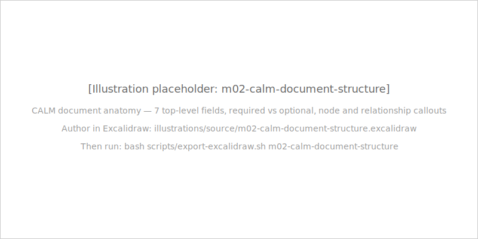

| Field | Required | Purpose |
|---|---|---|
| `$schema` | Yes | Points to CALM 1.2 schema; enables validation |
| `unique-id` | Yes | Machine identity for this architecture |
| `name` | Yes | Human-readable display name |
| `description` | Yes | One-to-two sentence summary |
| `nodes` | No (array) | System components |
| `relationships` | No (array) | Connections between nodes |

<!-- Speaker note: The top-level structure is deliberately minimal. Four required fields, two optional arrays, and a handful of advanced fields (metadata, controls, flows, adrs) that you add as the architecture matures. Every CALM file you will ever work with starts with these six fields. The $schema URL is the most important of all — it tells the validator which version of the spec to apply. -->

---

## The `$schema` URL is the version marker

```
https://calm.finos.org/release/1.2/meta/calm.json
```

This exact string is the single most important constraint in the spec.

**Common wrong values — all invalid for 1.2 work:**
- `https://calm.finos.org/release/1.0-rc1/meta/calm.json` ← files from 2023 blogs
- `https://calm.finos.org/release/1.1/meta/calm.json` ← pre-1.2 examples
- `https://calm.finos.org/meta/calm.json` ← missing the `/release/1.2/` segment

CALM governance cycle: **Draft** → **Release Candidate** → **Release**. CALM 1.2 is a Release — breaking changes require a new version number.

<!-- Speaker note: Memorise the URL. Not the concept — the actual URL string. When you are pairing with someone who has a validation failure, the wrong $schema is the first thing you check. Files produced against 1.0-rc1 used interface types (url-interface, host-port-interface) that do not exist in 1.2 — a wrong $schema can silently validate against an older spec that accepts things 1.2 rejects, and vice versa. -->

---

## Schema conformance vs spec discipline

**Schema conformance** — does this document have the right shape?

The validator will *not* reject:

```json
{ "unique-id": "my-service", "node-type": "container", ... }
```

`container`, `microservice`, `pod`, `lambda` — the schema's `anyOf` open branch accepts them.

**Spec discipline** — are you using only the 9 canonical types?

This is cultural. The course teaches it. Your team enforces it in code review. `calmstudio-mcp` enforces it at generation time.

> The validator is a floor, not a ceiling.

<!-- Speaker note: This surprises learners on first encounter. The schema does not reject invented node types — it has an open extension hook for future node packs. But CALM Studio, CALM Guard, and pattern matchers all depend on the 9 canonical types to function correctly. Invented types destroy tooling interoperability silently. No validation error. The architecture just does not render correctly and Guard cannot evaluate it. -->

---

## All 9 node types — at a glance

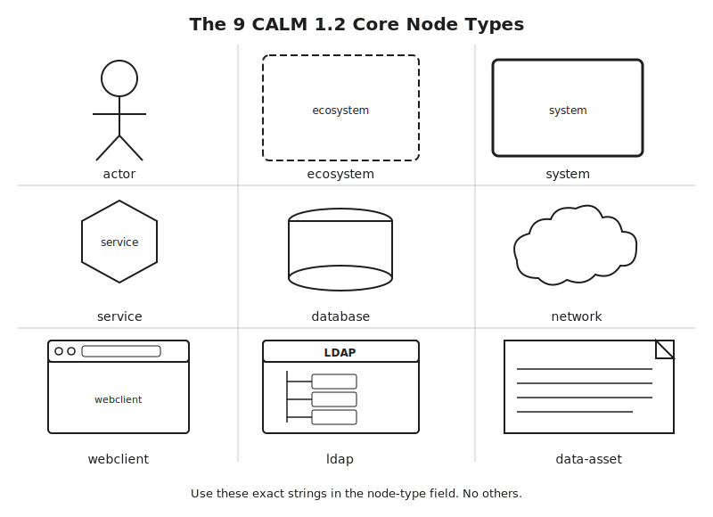

| Type | Use for |
|---|---|
| `actor` | Human user or external entity that initiates |
| `ecosystem` | Runtime platform (cluster, VPC, cloud account) |
| `system` | Logical boundary grouping related nodes |
| `service` | Running process that exposes capabilities |
| `database` | Any persistence technology |
| `network` | L3/L4 routing/filtering infrastructure |
| `webclient` | Browser, mobile, or desktop UI |
| `ldap` | Directory service / identity provider |
| `data-asset` | Named data artefact — files, topics, datasets |

<!-- Speaker note: This overview slide gives the full picture before the 9-slide gallery. The gallery that follows goes one type per slide with FSI examples and anti-patterns. After the gallery you will have seen every CALM type with a concrete FSI scenario. The most commonly confused trio: ecosystem vs system vs service — we will address that on each of those slides. -->

---

## Node type: `actor`

An `actor` is a human user, external system, or any external entity that **initiates** interactions with your architecture.

**The defining characteristic:** it pulls the trigger — it starts things.

**FSI example:** `trading-analyst` — a desk trader who visits the portal to submit orders. The analyst initiates; the portal is the destination.

**Anti-pattern:** Using `actor` for a payment service that makes outbound calls. Service-to-service communication uses `connects`, not `interacts`. `actor` is for entities outside your system boundary.

*Full file: `code-examples/module-02-calm-fundamentals/node-types-reference.architecture.json`*

<!-- Speaker note: The actor is always outside your system boundary. A human or a partner system that your architecture must respond to. Ask yourself: does this entity own any infrastructure in my architecture? If no — it is probably an actor. If yes — it is a service, system, or ecosystem. The test is initiation direction, not whether it is human. -->

---

## Node type: `ecosystem`

An `ecosystem` is a **runtime environment** — the platform that other nodes are deployed into.

**The defining characteristic:** other nodes live inside this.

**FSI example:** `prod-k8s-cluster` — the AWS EKS cluster into which trading services and databases are deployed. The cluster is the ecosystem; the services are deployed-in it.

**Anti-pattern:** Using `ecosystem` for a logical domain grouping of services. A "trade execution domain" that groups services by ownership is a `system`, not an `ecosystem`. `ecosystem` is a runtime concern, not a structural one.


<!-- Speaker note: The ecosystem vs system confusion is the most common in CALM modelling. Ask the question: "Does this thing host other things at runtime?" If yes, ecosystem. "Is this a logical boundary for organisational or domain ownership?" If yes, system. An AWS VPC is an ecosystem. The trade execution business domain is a system. -->

---

## Node type: `system`

A `system` is a **logical boundary** that groups related nodes structurally.

**The defining characteristic:** composed-of other nodes by domain or ownership, not by runtime deployment.

**FSI example:** `trade-execution-platform` — the logical boundary encompassing the order service, position service, and execution database that together fulfil trade processing.

**Anti-pattern:** Using `system` for a runtime environment like a Kubernetes cluster. If something hosts other nodes at runtime, it is an `ecosystem`. If it is a logical/domain grouping, it is a `system`.

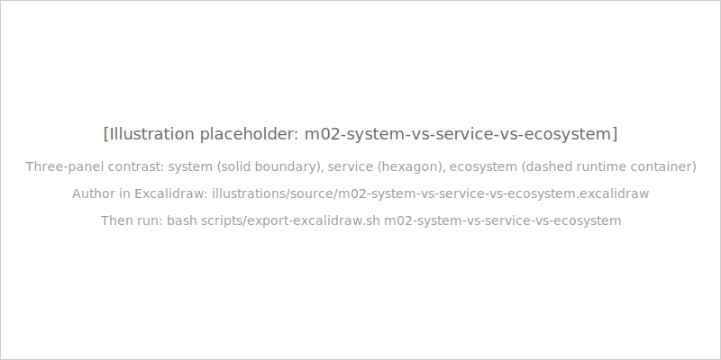

<!-- Speaker note: The system node is the DDD bounded context of CALM. It draws the organisational or domain boundary. A team owns a system. The Kubernetes cluster the team deploys into is an ecosystem — it may be owned by a platform team and shared across many systems. These are genuinely different things and the distinction matters downstream in Guard and pattern matching. -->

---

## Node type: `service`

A `service` is a **running process** that exposes capabilities.

**The defining characteristic:** it runs, processes requests, and exposes an interface.

**FSI example:** `order-service` — a microservice that validates order submissions, applies risk limits, and routes orders to the exchange gateway. Running, processing, exposing — service.

**Anti-pattern:** Using `service` for something that does not run as an active process. A message queue topic is a `data-asset`. A Kubernetes cluster is an `ecosystem`. A settlement system boundary grouping five microservices is a `system`.

*Full file: `code-examples/module-02-calm-fundamentals/node-types-reference.architecture.json`*

<!-- Speaker note: Microservices, REST APIs, gRPC servers, batch jobs, serverless functions, message consumers — all services. The test: "Does this run and serve?" If yes, service. Lambdas and serverless functions are services. The data they produce might be data-assets. The cluster they run in is an ecosystem. Keep the node type aligned with what the thing IS, not what it does to data. -->

---

## Node type: `database`

A `database` is any **persistence technology** accessed by services to read or write state.

**The defining characteristic:** stores state; services connect to it to read or write.

**FSI example:** `trades-db` — a PostgreSQL database persisting submitted trade orders, execution records, and settlement confirmations. Accessed by the Order Service via JDBC.

**Anti-pattern:** Using `database` for a Kafka topic or event stream. A Kafka topic is a `data-asset` — data in motion. A Kafka broker running and serving is a `service`. Use `database` for systems whose primary purpose is stateful data storage and retrieval.

*Full file: `code-examples/module-02-calm-fundamentals/node-types-reference.architecture.json`*

<!-- Speaker note: Relational (PostgreSQL, Oracle), NoSQL (MongoDB, DynamoDB), in-memory cache (Redis), object store (S3), columnar (Snowflake) — all databases. The database vs data-asset distinction is about whether it is active storage infrastructure or a named data artefact. Redis is a database. The cache key namespace it holds is closer to a data-asset. When in doubt: can a service query this interactively at runtime? Database. -->

---

## Node type: `network`

A `network` node represents **L3/L4 infrastructure** that sits between other nodes in the data path.

**The defining characteristic:** routes, filters, or proxies traffic — is not itself origin or destination of data.

**FSI example:** `edge-firewall` — a network appliance that inspects inbound traffic from the public internet before it reaches the trader portal. Infrastructure, not application.

**Anti-pattern:** Using `network` for a deployment environment. An AWS VPC is an `ecosystem`, not a `network`. The VPC provides the environment; the firewall inside it is the `network` node. Also not a Kafka broker or message queue — those are `service` or `data-asset`.

*Full file: `code-examples/module-02-calm-fundamentals/node-types-reference.architecture.json`*

<!-- Speaker note: Load balancers, firewalls, VPNs, CDN edge nodes, API gateways acting as proxies, DNS resolvers — all network nodes. The key is that the network node is in the data path but is not the application layer. It routes, filters, transforms at L3/L4. If it has business logic, it might be a service. If it just forwards or inspects packets, it is a network node. -->

---

## Node type: `ldap`

An `ldap` node represents a **directory service or identity provider** — Active Directory, LDAP servers, or identity platforms that expose directory queries.

**The defining characteristic:** identity infrastructure that other nodes depend on for authentication and group membership resolution.

**FSI example:** `corporate-directory` — the firm's Active Directory that the order service queries to authenticate users and resolve trading permissions.

**Anti-pattern:** Using `ldap` for a modern OAuth/OIDC provider like Keycloak or Auth0. Those are `service` nodes with authentication interfaces. `ldap` is specifically for directory protocol infrastructure.

*Full file: `code-examples/module-02-calm-fundamentals/node-types-reference.architecture.json`*

<!-- Speaker note: The ldap type is narrow by design. It specifically represents the LDAP directory protocol and the infrastructure built around it. If your identity provider exposes OAuth 2.0 or OIDC endpoints rather than LDAP, it is a service. The distinction matters because CALM Guard can apply different controls to ldap nodes vs service nodes — and the protocol enum includes LDAP specifically for connects relationships to ldap nodes. -->

---

## Node type: `webclient`

A `webclient` is a **browser-based, mobile, or desktop UI application** — the front-door interface a human user interacts with.

**The defining characteristic:** runs on the user's device, renders a UI, communicates with backend services.

**FSI example:** `trader-portal` — the browser-based web application through which trading analysts submit orders, monitor positions, and review execution history.

**Anti-pattern:** Using `webclient` for a mobile app backend API. The mobile app client is a `webclient`; the API it calls is a `service`. Also do not use `webclient` for a server-side rendered backend — the browser-facing component is the webclient, not the rendering server.

*Full file: `code-examples/module-02-calm-fundamentals/node-types-reference.architecture.json`*

<!-- Speaker note: The webclient sits at the user's device. An actor interacts with it. It calls backend services. This is the three-node pattern you will see constantly: actor → interacts → webclient → connects → service. The actor is the human; the webclient is the UI they use; the service is the backend. Keep these three distinct and your architecture modelling will be clean. -->

---

## Node type: `data-asset`

A `data-asset` represents **data at rest** — files, datasets, object storage buckets, Kafka topics (as data), or any named data artefact produced or consumed by services.

**The defining characteristic:** it is data, not a process.

**FSI example:** `end-of-day-positions` — a CSV file written by the Order Service at day-end containing aggregated position snapshots. Risk and reporting systems consume it.

**Anti-pattern:** Using `data-asset` for a running database. A PostgreSQL instance services query in real-time is a `database` (active persistence). `data-asset` is for the data itself — files, topics, datasets — not the infrastructure that stores or serves it.

You have now seen all 9 node types. Every CALM architecture uses some subset of these.

*Full file: `code-examples/module-02-calm-fundamentals/node-types-reference.architecture.json`*

<!-- Speaker note: Data-asset is often under-used. Engineers model everything as services or databases and omit the named data artifacts that flow between systems. Kafka topics, S3 bucket paths, FTP drop zones, database export files — all data-assets. Adding them to your architecture makes the data lineage visible and enables CALM Guard to apply data classification controls to the right nodes. -->

---

## The 5 relationship types

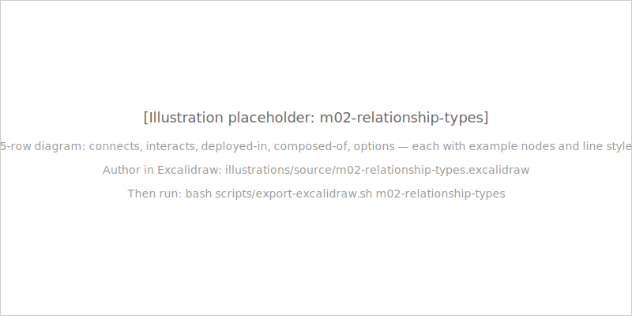

| Type | What it expresses |
|---|---|
| `connects` | Node-to-node data flow with a wire protocol |
| `interacts` | Actor initiating contact with one or more nodes |
| `deployed-in` | Runtime containment (where does this run?) |
| `composed-of` | Structural composition (what is this made of?) |
| `options` | ADR-in-spec: two or more architectural decision branches |

<!-- Speaker note: Five types cover the entire vocabulary of architectural connections. Every arrow you have ever drawn on a Visio diagram maps to one of these five. The most important distinction: deployed-in is a runtime concern, composed-of is a structural concern. Both can coexist for the same nodes — the same service can be deployed-in a cluster AND composed-of a logical system. They describe orthogonal views of the same nodes. -->

---

## `connects` — node to node with a protocol

```json
{
  "unique-id": "portal-to-payments-service",
  "description": "Payments portal calls the Payments Service API over HTTPS.",
  "relationship-type": {
    "connects": {
      "source": { "node": "payments-portal" },
      "destination": { "node": "payments-service" }
    }
  },
  "protocol": "HTTPS"
}
```

`protocol` is at the **TOP LEVEL** — a sibling of `relationship-type`. Never nested inside `connects`.

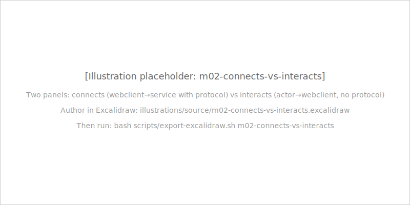

<!-- Speaker note: Read this slide twice. The protocol placement rule is the most common CALM authoring mistake. The schema does not reject protocol inside the connects sub-object — additionalProperties is true. But tools read protocol at the relationship level. Nesting it inside connects makes the protocol invisible to the validator, Studio, and pattern matchers. Always check: is my protocol a sibling of relationship-type? Not inside it. -->

---

## `interacts` — actor pulls the trigger

```json
{
  "unique-id": "analyst-interacts-portal",
  "description": "Payments analyst accesses the payments portal to submit and track payment instructions.",
  "relationship-type": {
    "interacts": {
      "actor": "payments-analyst",
      "nodes": ["payments-portal"]
    }
  }
}
```

- `actor` field **must reference a node with `node-type: actor`** — semantic constraint, not enforced by schema
- No `protocol` field — actors interact at the application level
- If you need to record the protocol of a human-to-UI interaction, add it to `description`

<!-- Speaker note: The interacts relationship is the front door of your architecture. It is how the world gets in. The actor field must reference an actor-typed node — if you put a service node there, CALM Studio and pattern matchers will misinterpret the relationship. CALM Guard uses the actor field to identify trust boundaries. The enforcement is tooling-level, not schema-level — culture and code review catch this. -->

---

## `deployed-in` vs `composed-of`

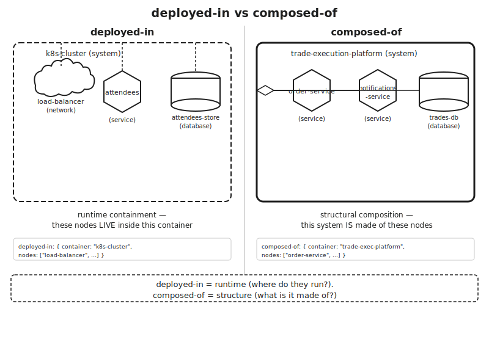

| Relationship | Question it answers | Typical container type |
|---|---|---|
| `deployed-in` | Where does this run? | `ecosystem` or `system` (runtime platform) |
| `composed-of` | What is this made of? | `system` (logical boundary) |

Both can coexist for the same nodes — orthogonal views.

```json
{ "deployed-in": { "container": "prod-k8s-cluster", "nodes": ["order-service"] } }
{ "composed-of": { "container": "trade-execution-platform", "nodes": ["order-service"] } }
```

<!-- Speaker note: The same order-service can be deployed-in a cluster AND composed-of a logical platform. These are not contradictory — they are different views of the same node. Deployed-in is the infrastructure view: where does it run? Composed-of is the domain view: what logical system does it belong to? Both relationships can appear in the same architecture and both will be valid. -->

---

## Protocol enum — all 12 values

`protocol` is a **top-level field** on `connects` relationships. Exactly 12 valid values in CALM 1.2:

`HTTP` `HTTPS` `FTP` `SFTP` `JDBC` `WebSocket` `SocketIO` `LDAP` `AMQP` `TLS` `mTLS` `TCP`

| Protocol | When to use |
|---|---|
| `HTTPS` | TLS-encrypted web traffic — the default for public/cross-boundary APIs |
| `JDBC` | Java database connectivity — service-to-database from JVM runtimes |
| `AMQP` | Message queues (RabbitMQ, Azure Service Bus, Kafka-adjacent) |
| `mTLS` | Zero-trust service mesh — both sides present certificates |
| `WebSocket` | Persistent bidirectional web connections — market data feeds |
| `LDAP` | Directory service queries — use specifically for `ldap` node connections |

Using any other string causes a schema validation error. Use the closest enum value and explain in `description`.

<!-- Speaker note: Protocol is a top-level field on the relationship, not nested inside the connects object. Say it again for emphasis. The full 12 values are in this table. If someone says "what about REST?" — REST is not a protocol, it is an architectural style. REST over TLS is HTTPS. If someone says "what about Kafka?" — AMQP is the closest enum match; document the actual technology in description. The enum is deliberately narrow to force precision. -->

---

## Interfaces — technical contracts on nodes, not relationships

**Interfaces describe how to reach a node. Relationships describe whether nodes are connected.**

| Thing | Where it lives | What it answers |
|---|---|---|
| Interface | On a **node** (in `interfaces[]`) | How do you reach me? (port, protocol, schema, URL) |
| Relationship | In `relationships[]` array | Are these two nodes connected? Via which mechanism? |

A `connects` relationship without interfaces just says "these nodes talk."  
Add interfaces and the relationship becomes auditable: "they talk via **this specific interface**."

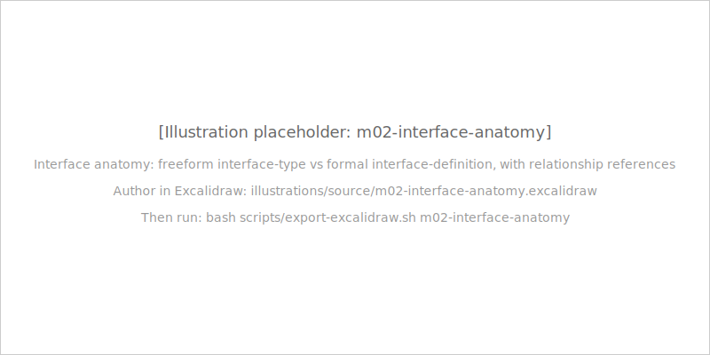

<!-- Speaker note: Interfaces are where CALM becomes more than a diagram. A connects relationship tells you A talks to B. An interface on B tells you exactly what port, protocol, and schema is available. That is enough information for a port scanner to verify the interface is open, for a schema validator to check the payload, and for CALM Guard to confirm the interface uses the declared protocol. Without interfaces, these checks are impossible. -->

---

## Interface form 1 — freeform (interface-type)

The freeform form is a JSON object with `unique-id` plus any additional properties you choose.

```json
{
  "unique-id": "orders-api-rest",
  "name": "Orders REST API",
  "protocol": "HTTPS",
  "port": 8443
}
```

- Only required field: `unique-id`
- Add whatever fields make the interface useful: `url`, `schema`, `description`, `port`, `protocol`
- Use freeform in most cases — sufficient for the majority of architectural documentation

*Full file: `code-examples/module-02-calm-fundamentals/with-interfaces.architecture.json`*

<!-- Speaker note: Freeform interfaces are pragmatic. Start with unique-id, add protocol and port, add a URL if you have one, add an OpenAPI spec URL if you have that. You can add any property you want — the schema allows additionalProperties. The only non-negotiable is unique-id, because relationships reference interfaces by unique-id in their source.interfaces and destination.interfaces arrays. -->

---

## Interface form 2 — formal (interface-definition)

The formal form uses `definition-url` to reference an external JSON Schema and `config` to satisfy it.

```json
{
  "unique-id": "orders-api-host-port",
  "definition-url": "https://calm.finos.org/release/1.2/prototype/interface/tcp-host-port.json",
  "config": {
    "host": "orders-api.internal",
    "port": 8443
  }
}
```

All three fields are **required**: `unique-id`, `definition-url`, `config`.

**Note:** 1.0-rc1's `url-interface` and `host-port-interface` are **gone in 1.2** — do not copy from pre-1.2 examples.

*Full file: `code-examples/module-02-calm-fundamentals/with-interfaces.architecture.json`*

<!-- Speaker note: The formal form is for when your platform team has published canonical interface schemas that all services must conform to, or when you are contributing to a CALM Pattern that downstream architectures must instantiate correctly. The definition-url is the schema; the config is your architecture's answer to that schema. CALM Guard can validate that config satisfies the schema at definition-url. -->

---

## Controls — testable compliance, not prose

```json
{
  "encryption-in-transit": {
    "description": "All connections must use TLS 1.3 or higher.",
    "requirements": [
      {
        "requirement-url": "https://example.com/security/encryption-in-transit.json",
        "config": {
          "protocol": "TLS",
          "minimumVersion": "1.3"
        }
      }
    ]
  }
}
```

`requirement-url` = **the standard**. `config` = **this architecture's answer to the standard**.

CALM Guard evaluates this. Auditors receive a structured artifact — not a slide deck.

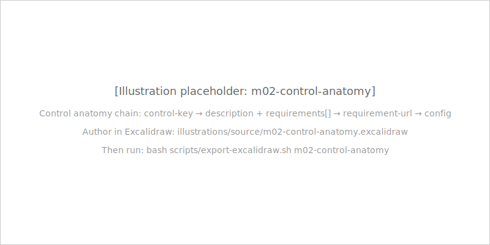

<!-- Speaker note: The distinction between "encrypt all traffic with TLS" in a description field versus a requirements array with a requirement-url and config is the difference between documentation and compliance. Tools can only act on the structured part. The requirement-url points to a JSON Schema — the standard. The config provides the values. CALM Guard checks that config satisfies the schema. That is machine-verifiable compliance. -->

---

## Control anatomy — the complete structure

```json
{
  "control-key": {
    "description": "Human-readable policy statement.",
    "requirements": [
      {
        "requirement-url": "https://standard-body.org/controls/my-control.json",
        "config": { "key": "value" }
      }
    ]
  }
}
```

- **Control key:** kebab-case string (`^[a-zA-Z0-9-]+$`). Examples: `encryption-in-transit`, `data-classification`, `mutual-tls`
- **`description`:** required — the policy in plain English
- **`requirements[]`:** required — at least one requirement with `requirement-url` + `config`
- FINOS CCC is a canonical source of `requirement-url` schemas for FSI use cases

<!-- Speaker note: The control key is the identifier. It must be kebab-case — no spaces, no underscores. The description is for humans. The requirements array is for machines. Each requirement maps to one standard or control catalog entry. A single control can reference multiple standards — add multiple requirement objects if an encryption policy maps to both an internal standard and a FINOS CCC requirement. Module 4 covers CCC in depth. -->

---

## Where controls attach — 4 scopes

**1. Top-level** — system-wide policies; sibling of `nodes` and `relationships`
```json
{ "$schema": "...", "unique-id": "...", "controls": { "encryption-in-transit": {...} }, "nodes": [...] }
```

**2. Per-node** — component-specific policies (data classification on a database)
```json
{ "unique-id": "kyc-records-db", "node-type": "database", "controls": { "data-classification": {...} } }
```

**3. Per-relationship** — connection-specific policies (mTLS on a specific service-to-service call)
```json
{ "unique-id": "kyc-firewall-to-kyc-service", "protocol": "mTLS", "controls": { "mutual-tls": {...} } }
```

**4. Per-flow** — transaction-sequence policies (covered in Module 3)

*Full file: `code-examples/module-02-calm-fundamentals/with-controls.architecture.json`*

<!-- Speaker note: Use the scope that matches the policy's reach. A TLS requirement for the whole system lives at the top level. A PII data retention requirement for a specific database lives on that node. An mTLS certificate rotation requirement for a specific connection lives on that relationship. Attaching a top-level control when a per-relationship control is more appropriate is a common mistake — be precise about scope. -->

---

## Decorators are SEPARATE documents

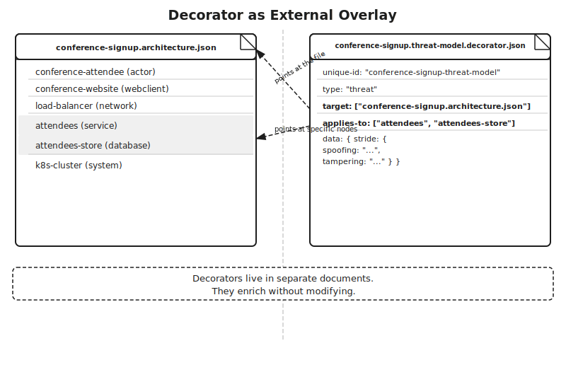

**The insight:** cross-cutting enrichment belongs in separate documents.

- **Security team** → threat decorator → references specific nodes via `applies-to`
- **Ops team** → deployment-info decorator → references the architecture file via `target`
- **Governance team** → governance/AIGF decorator → references `ai:*` nodes

The architecture file does not change. Each team owns their own overlay. The same insight that made CSS separate from HTML.

<!-- Speaker note: Without decorators, all three teams edit the same architecture file. Coordination overhead is high, review cycles are tangled, and the file becomes a catch-all. Decorators decouple authorship. The architecture is authoritative for what exists. Each decorator is authoritative for what one team says about what exists. This is the design principle behind AIGF auto-attaching as a decorator when ai:* nodes appear — the architecture does not need to know governance exists. -->

---

## Decorator anatomy

```json
{
  "unique-id": "conference-signup-threat-model",
  "type": "threat",
  "target": ["conference-signup.architecture.json"],
  "applies-to": ["attendees", "attendees-store"],
  "data": {
    "stride": {
      "spoofing": "Attendee identity not verified before write — mitigate with pre-registration token",
      "tampering": "DB write path not idempotent — mitigate with transaction IDs"
    }
  }
}
```

- `target[]` — **the file** (architecture document paths or Hub URLs)
- `applies-to[]` — **nodes/relationships within that file** (by `unique-id`)
- `data` — free-form payload; at least one property required (`minProperties: 1`)

<!-- Speaker note: The decorator is a first-class CALM artifact — it has its own unique-id. It is not embedded in the architecture. It points at the architecture via target. It scopes itself to specific nodes via applies-to. The data field is completely free-form beyond needing at least one property. Common types by convention: threat, governance, deployment-info, pattern. CALM 1.2 does not enumerate them — type is a free-form string. -->

---

## Common decorator types

CALM 1.2 does not enumerate decorator types — `type` is a free-form string. Used by convention:

| Type | What it carries |
|---|---|
| `threat` | STRIDE or ATT&CK annotations. Used by CALM Guard's threat analysis agent. |
| `governance` | Regulatory/framework overlays. AIGF auto-attaches as a governance decorator on `ai:*` architectures. |
| `deployment-info` | Release tags, Kubernetes namespaces, environment labels. Used by CALM Hub to track deployment state. |
| `pattern` | Marks a node as an instance of a known CALM Pattern — enables Guard conformance checking. |
| `saif` | Google SAIF principle mapping. Attached to `ai:*` nodes in Module 5. |

**The critical mistake:** embedding decorator data in `metadata` fields inside the architecture. Do not do this. Separate files, separate teams, separate review cycles.

<!-- Speaker note: The most common mistake is using the architecture's metadata field as a dumping ground for threat data, deployment info, and governance annotations all mixed together. Three teams then need to edit the same node object. Decorators solve this. Each type in this table corresponds to a different team's authorship domain. The architecture stays clean. The teams work independently. The tooling sees the complete bundle. -->

---

## Building the conference signup architecture

**The system:** conference attendees register via a browser portal. A backend service stores records in a database. Everything runs in a Kubernetes cluster.

| Node | Type | Role |
|---|---|---|
| `conference-attendee` | `actor` | Person signing up |
| `conference-website` | `webclient` | Browser signup portal |
| `load-balancer` | `network` | Routes traffic into the cluster |
| `attendees` | `service` | Backend handling registrations |
| `attendees-store` | `database` | Persistent registration storage |
| `k8s-cluster` | `system` | Kubernetes deployment environment |

**7 steps:** skeleton → nodes → relationships → interface → control → validate → visualise

<!-- Speaker note: This is a real-world architecture pattern you have probably built. It is small enough to build in one sitting but exercises every concept from this module: all relevant node types, four relationship types, an interface contract, and a system-wide security control. Walk through each step and you will have the muscle memory for the CALM authoring workflow. -->

---

## Step 1: The skeleton

Every CALM architecture starts with the four required fields plus two empty arrays:

```json
{
  "$schema": "https://calm.finos.org/release/1.2/meta/calm.json",
  "unique-id": "conference-signup",
  "name": "Conference Signup System",
  "description": "A registration system where conference attendees sign up via a
    browser-based portal backed by a REST service and a database.",
  "nodes": [],
  "relationships": []
}
```

Save as `conference-signup.architecture.json`.

Run `npx @finos/calm-cli validate -a conference-signup.architecture.json -f pretty` → **No issues found**.

An empty architecture with four required fields is already valid.

<!-- Speaker note: Start here every time. Do not add nodes first. Create the skeleton, validate it, then add nodes. This discipline means you have a valid file at every step — you can validate after each addition and know exactly which change caused any error. The unique-id is what other CALM artifacts (decorators, patterns, Hub entries) reference when pointing at this document. Choose it carefully. -->

---

## Step 2: Add 6 nodes

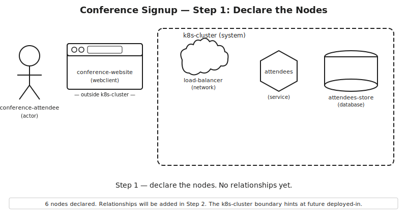

```json
"nodes": [
  { "unique-id": "conference-attendee", "node-type": "actor",
    "name": "Conference Attendee", "description": "Person registering for the conference." },
  { "unique-id": "conference-website", "node-type": "webclient",
    "name": "Conference Website", "description": "Browser-based signup portal." },
  { "unique-id": "load-balancer", "node-type": "network",
    "name": "Load Balancer", "description": "Routes HTTPS traffic into the cluster." },
  { "unique-id": "attendees", "node-type": "service",
    "name": "Attendees Service", "description": "Backend handling signup requests." },
  { "unique-id": "attendees-store", "node-type": "database",
    "name": "Attendees Store", "description": "Persistent storage for registrations." },
  { "unique-id": "k8s-cluster", "node-type": "system",
    "name": "Kubernetes Cluster", "description": "Production deployment environment." }
]
```

Note: `k8s-cluster` is `"node-type": "system"` — not `"ecosystem"`. A controlled, operated Kubernetes cluster is a system you own, not an uncontrolled external ecosystem.

<!-- Speaker note: Every node has all four required fields: unique-id, node-type, name, description. Validate after adding the nodes array. Note the k8s-cluster type carefully — system, not ecosystem. The original FINOS conference signup pattern file asserts system for this node and that is correct for 1.2. You control and operate this cluster. Ecosystem is for things like the public internet or an AWS region that you treat as a boundary. -->

---

## Step 3: Add the relationships

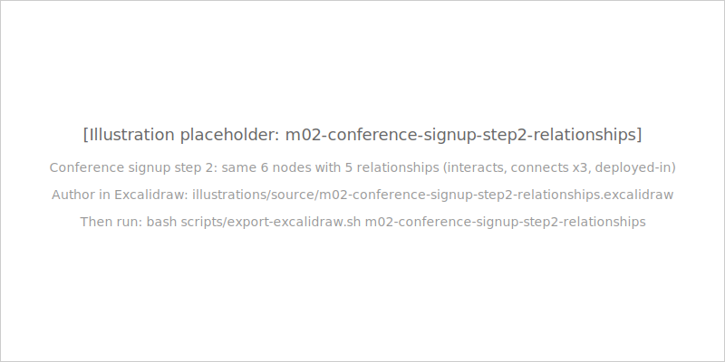

Five relationships connect the 6 nodes:

1. `interacts`: conference-attendee → conference-website
2. `connects` (HTTPS): conference-website → load-balancer
3. `connects` (mTLS): load-balancer → attendees
4. `connects` (JDBC): attendees → attendees-store
5. `deployed-in`: k8s-cluster contains load-balancer, attendees, attendees-store

*Full file: `code-examples/module-02-calm-fundamentals/conference-signup.architecture.json`*

<!-- Speaker note: The actor and webclient are NOT deployed-in the cluster — they exist outside it. Only the infrastructure nodes (load-balancer, attendees, attendees-store) are deployed inside k8s-cluster. This is a common modelling error: putting the conference-attendee actor inside the cluster because it initiates the flow. The actor lives outside your system boundary — that is what makes it an actor. -->

---

## Step 3 detail: `connects` with protocol at the TOP LEVEL

Correct — `protocol` at the relationship level (sibling of `relationship-type`):

```json
{
  "unique-id": "website-to-load-balancer",
  "description": "Conference website sends signup requests over HTTPS.",
  "relationship-type": {
    "connects": {
      "source": { "node": "conference-website" },
      "destination": { "node": "load-balancer" }
    }
  },
  "protocol": "HTTPS"
}
```

Wrong — `protocol` nested inside `connects` (silent tooling failure):
```json
{ "relationship-type": { "connects": { "source": {...}, "destination": {...}, "protocol": "HTTPS" } } }
```

<!-- Speaker note: If you remember one thing from this module, let it be this: protocol is a sibling of relationship-type, not a child of connects. The schema will not catch the wrong form — additionalProperties is true on the connects object. But every tool that reads protocol will look at the relationship level. Nesting it inside connects is the most common CALM authoring mistake we see in code review. -->

---

## Step 4: Add an interface on the attendees service

Interfaces live in the node's `interfaces[]` array:

```json
{
  "unique-id": "attendees",
  "node-type": "service",
  "name": "Attendees Service",
  "description": "Backend service handling signup requests.",
  "interfaces": [
    {
      "unique-id": "attendees-api",
      "name": "Attendees REST API",
      "protocol": "HTTPS",
      "port": 8443
    }
  ]
}
```

This interface says: "the attendees service is reachable at port 8443 over HTTPS."

Tools can use this to check that port 8443 is open in the cluster's network policy, or that the TLS certificate on that port is valid.

<!-- Speaker note: The interface makes the claim checkable. Without it, the connects relationship says load-balancer talks to attendees. With it, we know exactly which port and protocol. A network scanner can verify port 8443 is open. A certificate validator can check the TLS cert. CALM Guard can evaluate whether port 8443 has the right security controls applied. This is the precision that makes CALM more than a diagram. -->

---

## Step 5: Add encryption-in-transit control

Top-level `controls` — system-wide policies, sibling of `nodes` and `relationships`:

```json
{
  "$schema": "https://calm.finos.org/release/1.2/meta/calm.json",
  "unique-id": "conference-signup",
  "controls": {
    "encryption-in-transit": {
      "description": "All data transmitted between system components must use TLS 1.3 or higher.",
      "requirements": [
        {
          "requirement-url": "https://example.com/security/encryption-in-transit.json",
          "config": {
            "protocol": "TLS",
            "minimumVersion": "1.3",
            "certificateValidation": "required"
          }
        }
      ]
    }
  },
  "nodes": [...],
  "relationships": [...]
}
```

*Full file: `code-examples/module-02-calm-fundamentals/conference-signup.architecture.json`*

<!-- Speaker note: The encryption-in-transit control says: every connection in this architecture must use TLS 1.3. CALM Guard reads this and evaluates every connects relationship against it. Any connection using HTTP instead of HTTPS or TLS will be flagged. This is what makes CALM controls machine-verifiable — not a prose statement, but a structured JSON object with a schema URL that Guard can evaluate. -->

---

## Step 6: Validate

```bash
$ npx @finos/calm-cli validate \
    -a conference-signup.architecture.json \
    -f pretty
```

Expected output:

```
No issues found
```

Common errors and causes:

| Error | Likely cause |
|---|---|
| `undefined is not an object` | Missing required field or typo in field name |
| `node-type must be one of...` | Invented node type (`container`, `microservice`) |
| `protocol is not a valid enum value` | Check capitalisation: `HTTPS`, `mTLS`, `JDBC`, `WebSocket` |
| Validator crashes with `TypeError` | `options` relationship — known CALM CLI 1.44.1 limitation |

<!-- Speaker note: Run the validator at every step, not just at the end. If you validate after adding each node and relationship, you know immediately which addition caused an error. The options relationship crash is a known CLI bug — track the CALM CLI GitHub issues for the fix. All other errors in this table are authoring mistakes that the validator correctly flags. -->

---

## Step 7: Visualise in CALM Studio

```
https://studio.calm.finos.org
```

Click **Import** → paste or upload `conference-signup.architecture.json`.

The canvas renders:
- 6 nodes in their canonical shapes
- 5 relationship edges with type and protocol labels
- `attendees` node with interface callout (port 8443)
- `k8s-cluster` system shown as a container around the three deployed-in nodes

You can click any node, drag to rearrange, export canvas as SVG.

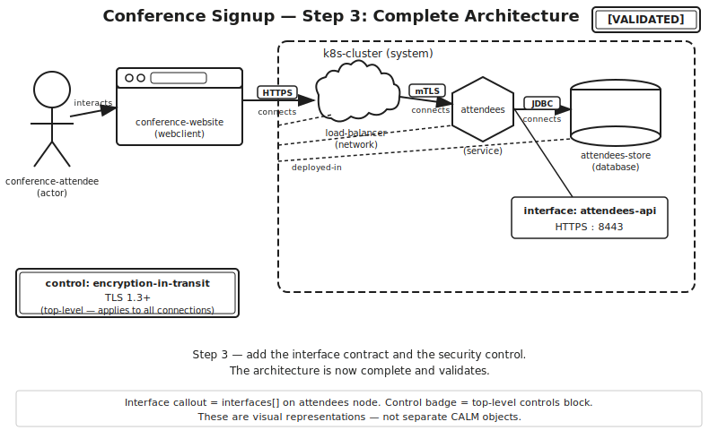

<!-- Speaker note: CALM Studio is the visual verification step. After validate passes, Studio is where you confirm the architecture looks like what you intended. The container rendering — k8s-cluster wrapping the three deployed-in nodes — is the visual proof that your deployed-in relationship is correct. The interface callout on the attendees node confirms the interface was attached to the right node. Studio and the CLI validator together give you structural and visual correctness. -->

---

## Lab 2 — your turn

**Lab:** `labs/lab-02-conference-signup/`

You will build the conference signup architecture from a blank skeleton — the same 7 steps just demonstrated.

**Scenario:** the same 6 nodes, 5 relationships, 1 interface, 1 control, validated with the CALM CLI.

**Lab steps (overview):**
1. Inspect the starter skeleton — understand what is provided
2. Add the 6 nodes with correct types and required fields
3. Add the 5 relationships — watch the protocol placement
4. Add the freeform interface on the attendees service
5. Add the encryption-in-transit top-level control
6. Validate with `npx @finos/calm-cli validate -a` — reach `No issues found`
7. Import into CALM Studio and verify the visual canvas

**Time budget:** 35 minutes for self-paced learners; workshop instructors pace per cohort.

<!-- Speaker note: The lab is hands-on reproduction of everything just demonstrated. The starter provides the skeleton and the node list — learners add relationships, the interface, and the control themselves. The step-check validates each addition as they go, catching the protocol-placement mistake and invented node types before they get to validate. This is where vocabulary becomes muscle memory. The lab is in labs/lab-02-conference-signup/ — instructors should verify the lab environment is running before the session starts. -->

---

## Module 2 cheatsheet

One-page printable reference — keep it at your desk:

**`docs-meta/cheatsheets/module-02-cheatsheet.md`**

Contains:
- All 9 node types — use for / never use for
- All 5 relationship types — required fields / example use
- Protocol enum (all 12 values)
- Interface quick reference (both forms with code)
- Control skeleton (`encryption-in-transit` example)
- Decorator skeleton (`target` and `applies-to` shown)
- `$schema` URL for 1.2
- CLI command: `npx @finos/calm-cli validate -a <file> -f pretty`
- CALM Studio URL

<!-- Speaker note: The cheatsheet is the artefact that experienced practitioners keep open in a second window while authoring. Print it. Bookmark it. Every value in it was derived directly from the validated code examples — node descriptions match the reference files, protocol values match the schema enum, interface examples come from with-interfaces.architecture.json. No invented content. -->

---

## Module 2 summary

**You now know the CALM language.**

- **9 node types:** `actor` `ecosystem` `system` `service` `database` `network` `webclient` `ldap` `data-asset`
- **5 relationship types:** `connects` `interacts` `deployed-in` `composed-of` `options`
- **12 protocol values:** `HTTP` `HTTPS` `FTP` `SFTP` `JDBC` `WebSocket` `SocketIO` `LDAP` `AMQP` `TLS` `mTLS` `TCP`
- **2 interface forms:** freeform (unique-id + any fields) / formal (definition-url + config)
- **4 control scopes:** top-level / per-node / per-relationship / per-flow
- **Decorators:** separate documents — `target` + `applies-to` + free-form `data`
- **$schema URL:** `https://calm.finos.org/release/1.2/meta/calm.json`

**What is next:** Module 3 — The CALM ecosystem (CLI depth, Hub, Studio, Guard, CI/CD)

<!-- Speaker note: Close the deck. The vocabulary is complete. Module 3 takes the file you just built and puts it through the full CALM ecosystem — CLI depth, Hub registration, Studio bidirectional sync, Guard compliance automation, and CI/CD integration. The architecture you built in this module is the starting point for Module 3. Keep the conference-signup.architecture.json file. You will use it again. -->
