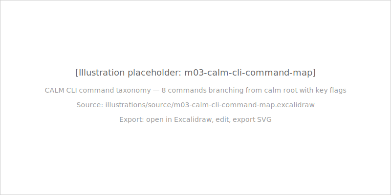
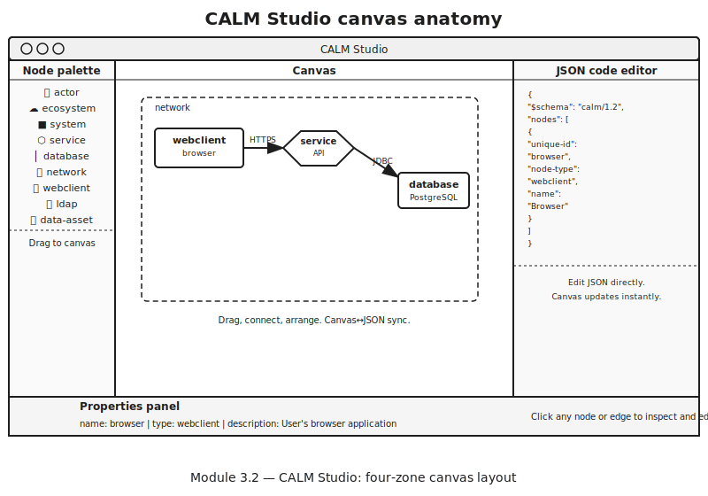
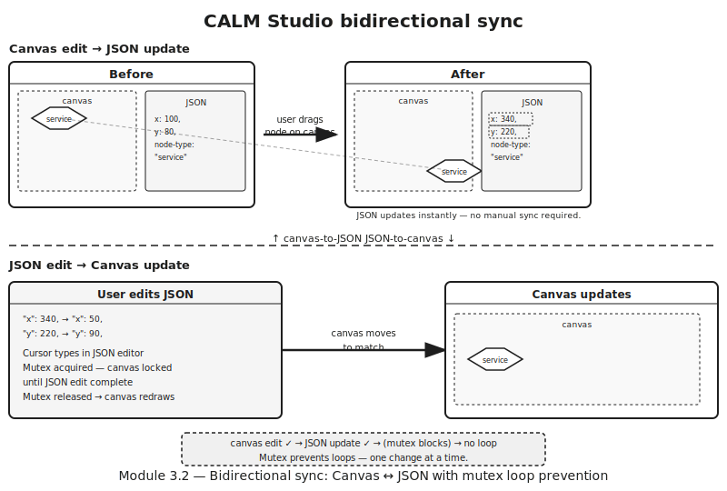
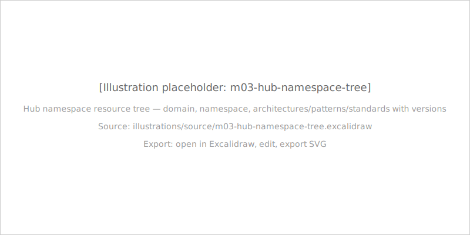
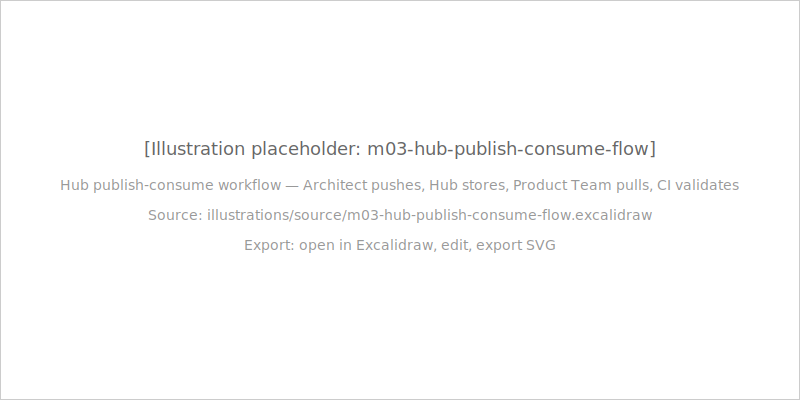
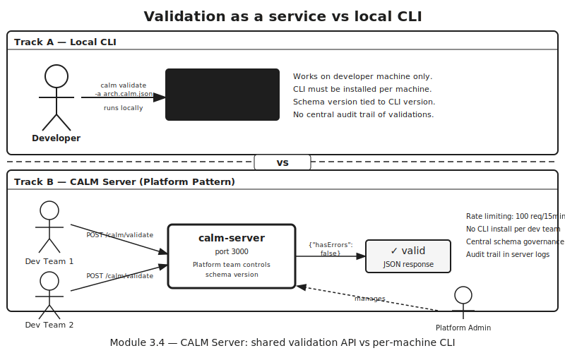
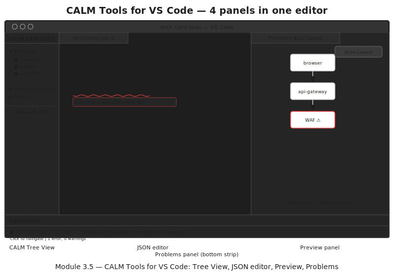
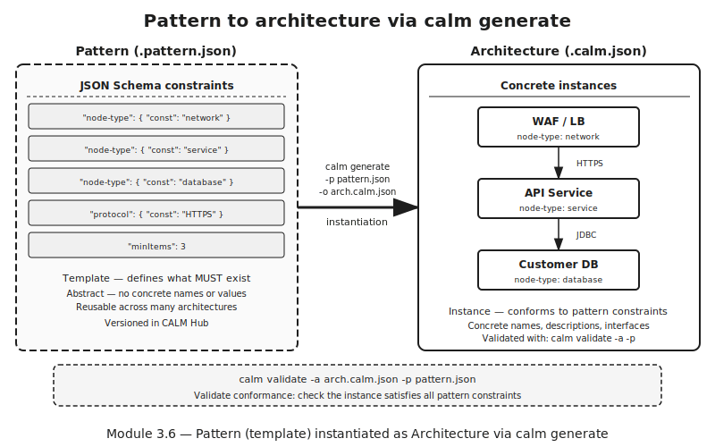
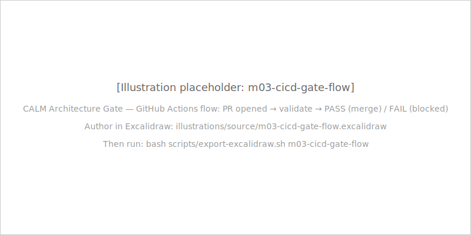
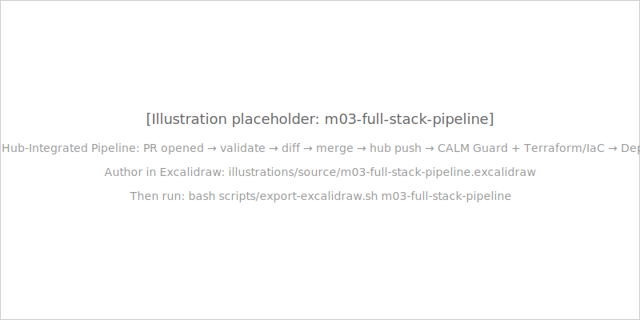

# Module 3: The CALM Ecosystem

## *"CLI · Studio · Hub · Server · VSCode · Patterns · CI/CD"*

<!-- Speaker note: Welcome to Module 3 — the tools module. Learners already know the CALM language from Module 2: 9 node types, 5 relationship types, interfaces, controls, decorators. Now we give them the full professional toolchain. By the end of this module they will be able to validate, generate, diff, and publish CALM architectures — and enforce architecture standards as a CI/CD gate. -->

---

## What you will learn in 3 hours

- **3.1** CLI commands — validate, generate, diff, timeline, hub
- **3.2** Studio canvas — visual editing, bidirectional sync
- **3.3** Hub registry — versioned, namespaced, discoverable
- **3.4** Server — validation as a platform service
- **3.5** VSCode extension — validate in your editor
- **3.6** Patterns — blueprint system, `calm generate`
- **3.7** CI/CD gate — architecture as a pipeline stage
- **Lab 3** — Build a complete GitHub Actions architecture gate

<!-- Speaker note: Each chapter teaches one tool, and the tools compound. The CLI is the foundation. Hub is the registry the CLI pushes to and pulls from. CI/CD is where everything comes together. The lab in Chapter 3.7 is the payoff — a complete GitHub Actions gate you will build and run yourself. -->

---

## Chapter 3.1: CALM CLI — Your Architecture Toolbox



`npm install -g @finos/calm-cli`

8 top-level commands: `validate`, `generate`, `diff`, `timeline`, `docify`, `template`, `init-ai`, `hub`

<!-- Speaker note: The CALM CLI is the single tool you will use most. Install once globally and every command in this module is available. The command taxonomy illustration shows the full surface — we will walk through the most important ones now. -->

---

## The `validate` command — schema vs conformance

**Schema validation only** (checks JSON shape and required fields):
```bash
calm validate -a arch.calm.json
```

**Pattern conformance** (schema AND topology constraint checking):
```bash
calm validate -a arch.calm.json -p secure-api-service.pattern.json
```

These are **two distinct operations** — not one.

| Flag | Purpose |
|------|---------|
| `-f json\|junit\|pretty` | Output format |
| `-o <file>` | Write output to file |
| `--strict` | Fail on warnings |
| `-c <hub-url>` | Resolve schemas from Hub |

<!-- Speaker note: This is the most important concept in Chapter 3.1. Without -p, the validator checks that the document is a valid CALM 1.2 document. With -p, it additionally checks that the architecture satisfies the pattern's constraints. You can have a perfectly valid CALM architecture that fails pattern conformance — and vice versa. Run them as separate CI steps so errors surface cleanly. -->

---

## Four more commands you need to know

| Command | What it does |
|---------|-------------|
| `calm generate -p pattern.json -o out.calm.json` | Instantiate a new architecture from a pattern |
| `calm diff -a v1.calm.json -b v2.calm.json -f summary` | Compare two architecture versions |
| `calm timeline -a v1.calm.json v2.calm.json -o tl.json` | Synthesise an evolution timeline |
| `calm hub push / pull / list` | Registry interaction (ships in CLI 1.45.0) |

**Hub commands ship** — they are not future gaps; treat them as fully available.

<!-- Speaker note: Point out the hub commands explicitly. A common misconception from older blog posts is that hub push/pull are aspirational. They ship in 1.45.0 and are fully usable today. Also note the diff command's --exit-code flag — we will cover the important pitfall with that flag in Chapter 3.7. -->

---

## CLI in CI — the JUnit integration point

```yaml
- name: Install CALM CLI
  run: npm install -g @finos/calm-cli

- name: Validate architecture
  run: calm validate -a arch.calm.json -f junit -o results.xml

- name: Upload results
  uses: actions/upload-artifact@v4
  if: always()
  with:
    name: calm-validation-results
    path: results.xml
```

"Architecture gets the same CI treatment as code."

<!-- Speaker note: The -f junit flag is the CI integration point. GitHub Actions, Jenkins, and CircleCI all parse JUnit XML natively and render it as a named test suite with pass/fail counts. Your architecture validation shows up as a first-class test result — not just "step failed" in a log. The if: always() on the upload step ensures you get results even on failure. -->

---

## Chapter 3.2: CALM Studio — Visual-First Design

`https://studio.calm.finos.org` — zero install, zero config



<!-- Speaker note: Studio is the visual layer on top of CALM JSON. Open a browser, go to studio.calm.finos.org, and start designing. No account, no configuration, no install. The canvas has four panels: the node palette on the left, the canvas in the centre, the JSON panel on the right, and properties below. -->

---

## Bidirectional sync — the core differentiator

"Edit the canvas or edit the JSON — both stay in sync."



Studio uses a **mutex** to prevent infinite update loops — one change at a time.

<!-- Speaker note: The mutex is the implementation detail that makes bidirectional sync work without infinite loops. A canvas change triggers a JSON update — the mutex blocks the resulting JSON change from triggering another canvas update. One change at a time, in the order you made it. This is the core Studio differentiator vs static diagram tools like Visio or Lucidchart — those are diagrams that happen to look like architecture; Studio is the architecture itself rendered visually. -->

---

## Studio vs CLI — different moments, same JSON

| When | Use | Why |
|------|-----|-----|
| Explore, present, onboard | Studio | Visual feedback catches structural problems humans miss in raw JSON |
| Validate, generate, CI/CD | CLI | Automated, scriptable, composable |
| Collaborate with non-technical stakeholders | Studio | Export to SVG or PNG — architecture is the single source of truth |
| Text-first authoring | VSCode + Preview Panel | In-editor feedback without context switch |

"Studio = lens. CLI = tool. Both read the same JSON."

<!-- Speaker note: Neither Studio nor the CLI is superior — they serve different moments in the workflow. Studio is the right tool when you need to communicate architecture visually or explore a complex topology. The CLI is the right tool when you need to automate, validate in CI, or generate architectures from patterns. The architecture JSON is the single source of truth in both cases. -->

---

## Chapter 3.3: CALM Hub — The Architecture Registry

"If CALM is your Terraform, Hub is your Terraform Cloud + Artifactory."



<!-- Speaker note: Hub solves the scaling problem. Without Hub, a secure-api-service pattern lives in a shared Git repo, teams copy it locally, the platform team updates it, and no one notices. Hub replaces copy-paste with namespace + version references. Teams reference Hub URLs in their CI pipelines. Updates propagate at the next CI run, not at the next quarterly review. -->

---

## The namespace model

Every Hub artifact has: **namespace + name + version + owner**

```
org.mybank/payments    → payment architecture artifacts
org.mybank/trading     → trading architecture artifacts
finos/reference        → FINOS published reference patterns
org.mybank/shared      → cross-domain shared components
```

REST API shape (consistent across all artifact types):
```bash
GET  /calm/namespaces
GET  /calm/namespaces/{ns}/architectures
POST /calm/namespaces/{ns}/architectures
GET  /calm/namespaces/{ns}/patterns
GET  /calm/namespaces/{ns}/standards
```

<!-- Speaker note: Namespaces are the governance boundary in Hub. A team can have write access to org.mybank/payments and read access to finos/reference, but cannot publish to another team's namespace. This is the same access control model that Artifactory uses for Maven artifacts or npm packages for JavaScript modules. -->

---

## Publish and consume workflow



**Version pinning** is the key concept — teams reference `namespace + version`; breaking changes require a new version number.

<!-- Speaker note: The publish-consume workflow is the enterprise governance story. Architects publish patterns and standards to Hub. Teams consume them by namespace + version reference. When the platform team needs to enforce TLS 1.3 instead of TLS 1.2, they publish a new version of the pattern. Teams pin to the new version on their own schedule — or a policy mandates it. Old consumers continue working against their pinned version during the migration window. -->

---

## Hub quickstart + MCP endpoint

```bash
cd calm-hub/deploy && docker-compose up
# Hub at http://localhost:8080
# Swagger: http://localhost:8080/q/swagger-ui/
```

Storage modes:
- **MongoDB** — production deployments
- **NitriteDB embedded** — local dev, no MongoDB needed

MCP endpoint (set `CALM_MCP_ENABLED=true`):
```
http://localhost:8080/mcp
```

"AI agents can query Hub: 'what patterns exist for secure API services?'"

<!-- Speaker note: Critical warning — Hub defaults to secure profile, which means 401 on everything. The docker-compose quickstart uses no-auth mode for local development. For production, configure OAuth2/OIDC via the Hub configuration. The MCP endpoint is genuinely useful — AI coding assistants can query the live Hub registry for available patterns before generating architecture suggestions. -->

---

## Chapter 3.4: CALM Server — Validation as a Service

"Platform team runs one server; all dev teams POST architectures to validate."



<!-- Speaker note: In large organisations, mandating CLI installation on every developer machine is impractical. Security teams resist it. Build environments are inconsistent. CALM Server solves this by centralising validation as an HTTP service. The platform team controls the schema version. When CALM updates, they update one server, not hundreds of developer machines. -->

---

## Server API and use case

```bash
# Start the server (port 3000, localhost, bundled schemas)
calm-server

# Custom port
calm-server --port 8080

# Hub-linked mode: schemas fetched from Hub at request time
calm-server -c http://hub.mybank.internal:8080

# Health check
curl http://localhost:3000/health
# → {"status": "OK"}

# Validate
curl -X POST http://localhost:3000/calm/validate \
  -H "Content-Type: application/json" \
  -d @arch.calm.json
# → {"hasErrors": false, "hasWarnings": false, ...}
```

Rate limiting: **100 requests / 15 minutes / IP** (configurable)

<!-- Speaker note: No built-in auth — bind CALM Server to an internal network only. Add a reverse proxy (nginx, Envoy, API gateway) for TLS termination and authentication. The Hub-linked mode is the most powerful for enterprise use: CALM Server fetches schemas from Hub at request time, so updating Hub immediately affects all validation without restarting the server. -->

---

## Chapter 3.5: CALM Tools for VS Code

`code --install-extension FINOS.calm-vscode-plugin`

Publisher: **FINOS** | Version: **0.6.0**



<!-- Speaker note: Search for "CALM Tools" in the VS Code marketplace. The publisher is FINOS — verify this to avoid the wrong extension. The extension activates automatically for any JSON file whose $schema field points to a CALM schema URL. No file association configuration required. -->

---

## Six extension features

1. **Interactive Preview Panel** — live diagram as you type; no save required
2. **Tree View Navigation** — browse nodes, relationships, flows by type
3. **Timeline Navigation** — explore architecture evolution by milestone
4. **Real-Time Validation** — Problems panel; same schema as `calm validate`
5. **Bundled Schemas** — offline validation, no network access required
6. **Template / Documentation Mode** — live `docify` output in the panel

"Problems panel catches errors before CI does — in the same editor session."

<!-- Speaker note: The bundled schemas feature is key for air-gapped enterprise environments. Teams in regulated financial services often cannot pull schemas from external URLs at development time. The extension ships the schemas so validation works completely offline. The same schema the Problems panel uses is the schema CI uses — so a file that passes the Problems panel will pass the CI gate. -->

---

## Chapter 3.6: Patterns and Standards — The Blueprint System



"Architecture standards become enforceable at the speed of a CLI command, not a committee meeting."

<!-- Speaker note: Patterns replace prose guidance with enforced constraints. The WAF-in-front-of-API-behind-database topology is not a suggestion in a Confluence page — it is a CALM Pattern with const constraints that calm validate -a -p verifies on every PR. Teams that conform get a green check. Teams that skip the WAF get a red one. -->

---

## Pattern vs architecture vs standard

| Artifact | Extension | Validates with | Purpose |
|----------|-----------|----------------|---------|
| Pattern | `.pattern.json` | `calm validate -p` | Template — defines required topology |
| Architecture | `.calm.json` | `calm validate -a` | Conforming instance — what does exist |
| Standard | varies | Referenced in validate call | Org-specific constraints on top of CALM 1.2 |

**The key distinction:** A pattern exists *before* any architecture is built — it is the specification. An architecture exists *after* — it is the implementation.

<!-- Speaker note: This distinction is the most important concept in Chapter 3.6. Students often conflate "pattern" and "architecture" because both are CALM JSON files. The difference is temporal and functional: the pattern defines what must exist; the architecture proves it exists. Both are validated with calm validate, but with different flags. -->

---

## The `calm generate` workflow

```bash
# Interactive — prompts for each non-const field
calm generate -p secure-api-service.pattern.json -o my-api.calm.json

# Non-interactive — for scripting and CI
calm generate -p pattern.json \
  --option-choices '{"api-type":"REST"}' \
  -o arch.calm.json

# From a Hub-hosted pattern — always uses the latest approved version
calm generate \
  -p http://hub.mybank.internal:8080/calm/namespaces/myorg/patterns/secure-api \
  -o arch.calm.json
```

"Generate + validate in sequence = your organisation's architecture onboarding story."

<!-- Speaker note: The Hub URL form is the enterprise pattern. Product teams consume the latest approved pattern without needing a local copy. When the platform team updates the pattern in Hub, all teams pull the updated constraints at their next calm generate invocation. This is architecture governance that propagates automatically. -->

---

## Chapter 3.7: CI/CD Integration — Architecture Gates

"Architecture drift starts the moment developers stop reading the docs. CI gates close that gap."



<!-- Speaker note: Architecture standards without enforcement are suggestions. A Confluence page that says "all API services must have a WAF in front" is overridden on the first deadline. A GitHub Actions step that fails the PR when the WAF is missing cannot be overridden. The only architecture standard that reliably holds is the one that blocks the merge. -->

---

## The GitHub Actions workflow

```yaml
- name: Install CALM CLI
  run: npm install -g @finos/calm-cli

- name: Validate architecture against schema
  run: calm validate -a architectures/secure-api.calm.json -f pretty

- name: Validate architecture against pattern
  run: |
    calm validate \
      -a architectures/secure-api.calm.json \
      -p patterns/secure-api-service.pattern.json \
      -f pretty

- name: Output JUnit test report
  run: |
    calm validate \
      -a architectures/secure-api.calm.json \
      -p patterns/secure-api-service.pattern.json \
      -f junit -o calm-validation-results.xml
```

<!-- Speaker note: Two separate validate steps by design. Schema errors and pattern errors need separate feedback so developers know exactly what to fix. A schema error means the CALM document is malformed. A pattern error means the architecture is valid CALM but violates the org's required topology. Different errors, different fixes, different owners. -->

---

## `calm diff` as PR automation

```bash
calm diff -a before.calm.json -b after.calm.json -f summary
```

**`--exit-code` flag:** exits non-zero when changes are detected.

**Correct use:** diff the PR version against the **Hub-published baseline** — surface architecture deltas for human review.

**Wrong use:** `--exit-code` on every commit will block every legitimate architecture update.

The `--exit-code` pitfall: using it to "detect unexpected changes" against the previous git commit blocks ALL PRs that intentionally evolve the architecture.

<!-- Speaker note: This is the pitfall where half the class goes wrong. --exit-code makes calm diff work like a gate — it exits non-zero when differences are detected. If you use it to compare against the previous commit, every PR that legitimately updates the architecture will fail the gate. The correct comparison is against the Hub-published baseline: the Hub version represents the approved, released architecture; the PR version is the proposed change. If they differ, that is something a human should review — not necessarily a blocker. -->

---

## Hub-integrated pipeline



The **Hub push step on merge** is the key architectural commitment — after merge, the architecture is the source of truth in Hub.

<!-- Speaker note: The Hub push on merge is the event that makes the pipeline real. Before merge, the architecture exists only in a branch. After merge and Hub push, it becomes the published, versioned, queryable source of truth that downstream teams reference. CALM Guard then picks up the published architecture and runs continuous compliance checks against it. This is architecture as code in the truest sense: it merges, it deploys, it gets compliance-checked. -->

---

## The blocking strategy

"Architecture must pass before IaC applies."

```
calm validate (gate 1: is the architecture valid?)
    ↓
terraform plan (gate 2: does the IaC match the architecture?)
    ↓
calm hub push (publish the approved architecture)
    ↓
CALM Guard (continuous compliance monitoring)
```

"Architecture is code. It merges, it deploys, it gets compliance-checked."

<!-- Speaker note: The sequencing matters. Architecture validation must come before IaC planning — you cannot plan infrastructure for an invalid architecture. Hub push must come after merge — you only publish what is approved. CALM Guard runs continuously after publish — it does not need a PR trigger. This four-stage pipeline is the enterprise architecture governance model. -->

---

## Lab 3: Build the Architecture Gate

**Time:** ~35 minutes | **No Docker required**

What you will build:
- A GitHub Actions workflow that validates a CALM architecture against a pattern on every PR
- A broken architecture — push it, watch the gate fail
- Fix the architecture — push again, watch the gate pass

Prerequisites:
- GitHub account (for Actions), OR `act` for local execution

```bash
# Local fallback — run the workflow without GitHub
brew install act
act push
```

<!-- Speaker note: The local fallback is important for learners who do not have a GitHub account or are in a restricted enterprise environment. act is an open source tool that runs GitHub Actions locally using Docker. The lab works identically with act. Students without GitHub access can use act: brew install act, then act push from the repo root. -->

---

## Module 3 Recap — What You Now Have

- **CLI:** validate, generate, diff, timeline, hub — the complete professional CALM toolchain
- **Studio:** visual canvas, bidirectional sync — zero-install visual design and communication
- **Hub:** versioned registry, namespace-scoped — architecture governance at scale
- **Server:** platform validation as a service — no per-developer install required
- **VSCode:** live validation, Preview Panel, Tree View — in-editor architecture workflow
- **Patterns:** blueprint system, conformance enforcement — standards as executable constraints
- **CI/CD:** architecture gates in GitHub Actions — drift prevention at the point of origin

<!-- Speaker note: These seven tools form a complete professional architecture workflow. The CLI is the foundation. Hub is the registry that connects them. CI/CD is where governance becomes enforcement. Module 3 is the "how do we operate CALM day-to-day" answer. Module 4 is "how do we govern it." -->

---

## What's Next — Module 4: Governance and CALM Guard

**Module 4: Governance, Compliance, and CALM Guard**

- The Gemara 7-layer GRC Engineering Model — **CALM is Layer 4**
- CALM Guard: AI-driven compliance automation (6-agent squad)
- Threat modeling as code — STRIDE decorators on CALM architectures
- Compliance frameworks: SOX, DORA, FINOS CCC, SR 11-7
- CALM Guard evidence package export — audit-ready compliance proofs

*"CALM defines what exists. CALM Guard proves it complies."*

<!-- Speaker note: Module 4 is the governance module. Everything you have learned in Modules 2 and 3 — the CALM language, the toolchain — becomes the foundation for a governance story that extends all the way to regulatory compliance. The Gemara 7-layer model is the conceptual frame: CALM at Layer 4 (Sensitive Activities) connects upward to compliance evidence (Layers 5-7) and downward to threat intelligence (Layers 1-3). -->
